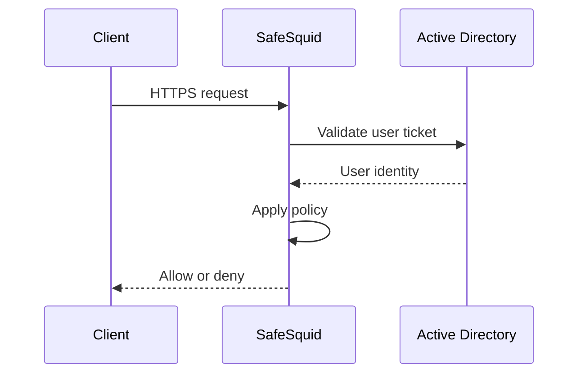

## Example: integrate Active Directory for SSO

This example integrates an Active Directory for SSO authentication.

**Active Directory (AD) FQDN**: ad.safesquid.test (Obtain the AD FQDN from: Start > Control Panel > System > Full Computer name)

**Active Directory (AD) IP Address**: 192.168.221.1

**Domain of Active Directory (AD)**: safesquid.test

**Base Dn of AD**: dc=safesquid,dc=test

**User Name**: administrator@safesquid.test (**User name should be any user from AD having administrative permissions**)

Monit service must be Up.
Verify it using command:

```bash
pidof monit
```
19940

See the Integrate LDAP section for the purpose of each field.

SSO flow with [Active Directory](https://learn.microsoft.com/en-us/windows-server/identity/ad-ds/get-started/virtual-dc/active-directory-domain-services-overview) and Kerberos:



## Prerequisites
Make sure that all the values (LDAP server FQDN, LDAP server IP, Username, password, base dn, domain) while configuration are correct. If any value is inappropriate then SafeSquid will fail to fetch the entries.

**Step 1**: Specify Name Server Addresses.

**Step 2**: Specify Time Synchronization Server.
:::note
Time Synchronization of AD server and Proxy server should be same. Verify it using "date" command
:::
**Step 3**: Add DNS entry of the SafeSquid server in the Active Directory server.

**Step 4**: Ensure the AD domain is resolvable from all clients and the SafeSquid server. See troubleshooting if needed.

After completing all steps above, SSO configuration can proceed.

## [Access the SafeSquid User Interface](/docs/SafeSquid%20SWG/Configuration%20Portal)


## Go to Application Setup


## Go to Integrate LDAP


## Ensure LDAP Section is enabled


## Go to LDAP servers


## Creating new entry


**why?**

In a network with multiple LDAP Servers, and multiple SafeSquid Proxy Servers deployed in Master-Slave mode, this field can be used to specify the Host Name of the Proxy Server, which will communicate with the LDAP Server configured.

Leave this field blank if this is the only SafeSquid proxy, or if all proxies should use the same LDAP server.


Use any Active Directory user with **Administrator permissions**


## Test User Extraction
Troubleshooting:

When the administrator saves the policy with NEGOTIATE_LDAP_AUTH selected

**kerberos.sh*** script will automatically run from path
```bash
/usr/local/safesquid/ui_root/cgi-bin
```
1.Verify below files at path:
```bash
/usr/local/safesquid/security
```
HTTP.keytab

krb5.conf

krb.tkt

2. SafeSquid creates the stub zone for DNS resolution of the Active Directory server.

The file with stub zone will create with the name: **safesquid.dns.conf**

At path:

/usr/local/safesquid/security/dns

Run command:
```bash
cat safesquid.dns.conf
```
zone safesquid.test \{

type stub;

masters \{192.168.221.1;\};

\};

Also, it will automatically copy at given path:

/etc/bind/

Run command:
```bash
cat safesquid.dns.conf
```
zone safesquid.test \{
type stub;
masters \{192.168.221.1;\};

\};
:::warning
Monit service must be up.
:::


:::warning
Ensure the AD domain is resolvable from all clients and the SafeSquid server.
:::

For troubleshooting Follow Link


Save Configuration

If no entries appear in the LDAP Entries subsection, validate all fields in the LDAP servers subsection.

If all fields are correct then

Find the error cause

Troubleshooting Steps


Clicking Save config prompts for confirmation to store the configuration in the cloud.

**Select Yes only when:**
1. The same configuration will be used on other SafeSquid instances.
2. All sections are fully configured and validated.

Otherwise select No and click Submit.
