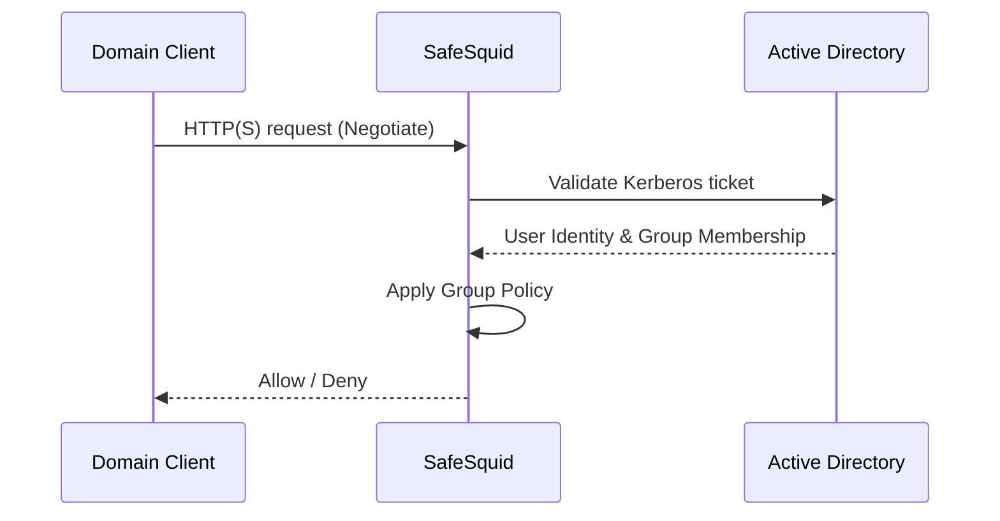

# AD SSO Authentication (Kerberos)

Kerberos-based SSO provides a seamless user experience for domain-joined workstations. Users are authenticated transparently via their domain ticket, eliminating browser credential prompts.

## How Kerberos SSO Works



:::info Prerequisites
- **Infrastructure Setup:** [Prerequisites & Infrastructure Setup](/docs/Authentication/Directory_Services/Active_Directory/Prerequisites_Infrastructure_Setup/) completed (DNS, DNSSEC, Monit, time sync, /tmp permissions).
- [Setup Active Directory Integration](/docs/Authentication/Directory_Services/Active_Directory/Setup_Active_Directory_Integration/) completed.
- **Time Sync:** SafeSquid and AD server time must match (max skew 5 mins).
- **DNS:** SafeSquid must resolve the AD domain; AD must have a DNS entry for SafeSquid.
- **Monit:** The Monit service must be running (`pidof monit`).
:::

## Configure SSO Authentication

1. **Access SafeSquid Interface:** Go to **Application Setup** → **Integrate LDAP**.
2. **Configure LDAP Server:**
   - Go to **LDAP Servers** tab and edit your entry.
   - **LDAP Bind Method:** Select **NEGOTIATE** (this enables Kerberos SSO).
   - **Bind DN:** Ensure this is a domain admin or account with high privileges to create the keytab.
3. **Automatic Keytab Generation:** 
   When you save with **NEGOTIATE**, SafeSquid automatically generates:
   - `HTTP.keytab`
   - `krb5.conf`
   - `krb.tkt`
   Verify these in `/usr/local/safesquid/security/`.


4. **DNS Stub Zone:** SafeSquid creates a stub zone for AD resolution in `/etc/bind/safesquid.dns.conf`. Ensure this is active.

## Enable SSO in Access Rules

1. **Navigate to Access Restrictions:** **Application Setup** → **Access Restrictions** → **Allow List**.
2. **Configure Rule:**
   - **PAM Authentication:** Set to **TRUE**.
   - **SSO:** Ensure the global SSO field is **TRUE** (default).
3. **Save and Apply:** Click the checkmark to save.

## Configure Windows Client for SSO

Domain-joined Windows clients require proper DNS configuration and proxy settings to enable transparent Kerberos authentication.

### Verify Client DNS Configuration

The Windows client must use your Active Directory DNS server for domain name resolution.

1. **Open Network Settings:**
   - Press `Win + R` → Type `ncpa.cpl` → Press Enter

2. **Check Active Network Adapter:**
   - Right-click your active network connection (Ethernet or Wi-Fi) → **Properties**
   - Select **Internet Protocol Version 4 (TCP/IPv4)** → **Properties**

3. **Verify DNS Server:**
   - **Preferred DNS server:** Should be your AD server IP (e.g., `192.168.1.1`)
   - **Alternate DNS server:** (Optional) Secondary AD DNS or gateway

4. **View Detailed DNS Info:**
   - Click **Details** button in the connection status window
   - **IPv4 DNS Server:** Must show your AD server IP

:::warning DNS Requirement
If the client is not using your AD DNS server, Kerberos authentication will fail. Update the DNS server setting before proceeding.
:::

### Configure Proxy Settings

**Critical:** Use the proxy server's **FQDN**, not its IP address. Kerberos service tickets are tied to the FQDN.

1. **Open Proxy Settings:**
   - Press `Win + I` → **Network & Internet** → **Proxy**
   - OR: `Win + R` → Type `inetcpl.cpl` → **Connections** tab → **LAN settings**

2. **Enable Manual Proxy:**
   - Check **Use a proxy server for your LAN**
   - **Address:** `proxy.safesquid.test` (use FQDN, **not** IP like `192.168.1.100`)
   - **Port:** `8080` (your SafeSquid listening port)

3. **Add Bypass Rules (Optional):**
   - In **Exceptions**, add local addresses that shouldn't use the proxy:
   ```
   localhost;127.0.0.1;*.local;192.168.*
   ```

:::tip Why FQDN?
Kerberos authenticates based on Service Principal Names (SPN). When you use `http://proxy.safesquid.test`, the browser requests a ticket for `HTTP/proxy.safesquid.test@SAFESQUID.TEST`. If you use the IP address, Kerberos cannot generate a valid ticket, and SSO fails.
:::

### Configure Browser for Integrated Windows Authentication

Ensure your browser is configured to send Kerberos tickets to the proxy.

**For Internet Explorer / Edge:**

1. **Open Internet Options:** `Win + R` → `inetcpl.cpl`
2. **Security Tab:**
   - Select **Local intranet** → **Sites** → **Advanced**
   - Add: `http://proxy.safesquid.test` or `http://*.safesquid.test`
3. **Advanced Tab:**
   - Scroll to **Security** section
   - Enable: **Enable Integrated Windows Authentication**

**For Chrome:**

Chrome inherits Windows settings by default. To explicitly allow Kerberos:

**Via Group Policy (Domain Admin):**
- Path: `Administrative Templates → Google Chrome → Policies for HTTP authentication`
- Setting: `Kerberos delegation server allowlist`
- Value: `proxy.safesquid.test` or `*.safesquid.test`

**Via Command Line (Local Testing):**
```cmd
chrome.exe --auth-server-whitelist="proxy.safesquid.test"
```

**For Firefox:**

1. Type `about:config` in the address bar
2. Search for: `network.negotiate-auth.trusted-uris`
3. Set value to: `proxy.safesquid.test` or `.safesquid.test`

### Test SSO Authentication

1. **Open Browser:** Launch Internet Explorer, Chrome, or Edge
2. **Navigate to any website:** Example: `http://www.google.com`
3. **Expected Result:** Website loads immediately without credential prompt

:::info First-Time Login
If you're prompted for credentials on first access, sign out and sign back into your Windows account, then try again. The Kerberos ticket cache refreshes on login.
:::

## Verification

| Action | Method | Expected Result |
|--------|--------|-----------------|
| **Transparent Login** | Access a website from a domain-joined client. | Website loads immediately without a credential prompt. |
| **Check Keytab** | `ls -l /usr/local/safesquid/security/HTTP.keytab` | File exists and has recent timestamp. |
| **Identity Log** | `tail -f /var/log/safesquid/identity.log` | Shows authenticated usernames in `user@DOMAIN` format. |
| **DNS Test** | `nslookup <AD_Domain>` from SafeSquid. | Successfully resolves to AD server IP. |

### Verify Authentication via Browser Developer Tools

Use browser developer tools to confirm Kerberos negotiation is occurring.

1. **Open Developer Tools:**
   - Press `F12` in your browser
   - Navigate to the **Network** tab

2. **Access a Website:**
   - Visit any external site (e.g., `http://www.google.com`)
   - Look for the first request in the network log

3. **Inspect Request Headers:**
   - Click on the request → **Headers** tab
   - Scroll to **Request Headers**
   - Look for: `Proxy-Authorization: Negotiate <token>`

4. **Inspect Response Headers:**
   - Look for: `Proxy-Authenticate: Negotiate`
   - This indicates the proxy is requesting Kerberos authentication

**What the headers mean:**

| Header | Direction | Meaning |
|--------|-----------|---------|
| `Proxy-Authenticate: Negotiate` | Proxy → Client | SafeSquid requests Kerberos ticket |
| `Proxy-Authorization: Negotiate YII...` | Client → Proxy | Browser sends Kerberos ticket (Base64-encoded) |

:::tip Success Indicator
If you see `Proxy-Authorization: Negotiate` with a long Base64 string, Kerberos SSO is working. If you see `Proxy-Authorization: Basic`, the browser is falling back to credential prompts.
:::

### Verify User Identity via client_id

SafeSquid assigns a unique `client_id` to each authenticated user for tracking and reporting.

1. **Access SafeSquid Interface:**
   - Navigate to: `http://safesquid.cfg` (from a client behind the proxy)

2. **View Your Client ID:**
   - The interface displays your current authenticated username and client_id
   - Format: `DOMAIN\username` or `username@domain.com`

3. **Cross-Reference in Logs:**
   ```bash
   # On SafeSquid server
   tail -f /var/log/safesquid/identity.log | grep "username@safesquid.test"
   ```

   **Expected output:**
   ```
   [2026-02-18 14:23:10] client_id: 5a3f8b2c, user: john.doe@safesquid.test, groups: Domain Users, IT Staff
   ```

This confirms:
- ✅ User authenticated via Kerberos
- ✅ AD group membership fetched
- ✅ client_id assigned for policy enforcement

## Troubleshooting

| Symptom | Likely Cause | Fix |
|---------|--------------|-----|
| Repeated prompts (SSO fail) | Time skew | Run `date` on AD and SafeSquid; sync via NTP if they differ by >5 mins. |
| Prompt on some browsers | Browser config | Ensure SafeSquid FQDN/IP is in the "Local Intranet" or "Trusted Sites" zone in Windows Internet Options. |
| Keytab not generated | Permission or Bind issue | Ensure Bind account has sufficient AD permissions; check `/var/log/safesquid/safesquid.log` for Kerberos errors. |
| DNS resolution fail | Missing stub zone | Verify `/etc/bind/safesquid.dns.conf` contains the correct AD server IP and is included in your BIND config. |

:::tip Browser Configuration
For Chrome and Edge to send Kerberos tickets, the SafeSquid proxy URL must be recognized as an intranet site. You can enforce this via GPO:
**Administrative Templates** → **Google Chrome** → **Kerberos delegation server allowlist**
:::

## Next steps

- [Access Restriction](/docs/Access_Restriction/) (Apply policies by AD group)
- [SSL Inspection](/docs/SSL_Inspection/) (Attribute HTTPS traffic to AD users)
- [Bypass Authentication](/docs/Authentication/Bypass_Authentication/) (For non-browser apps that don't support Kerberos)
