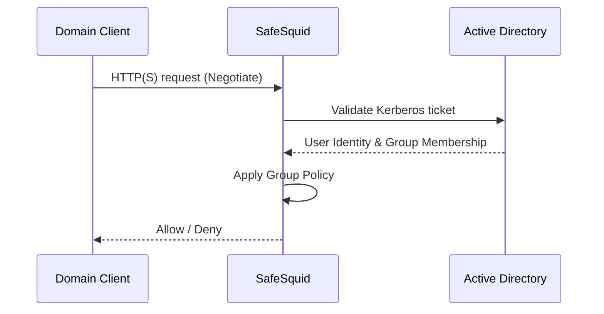

# AD SSO Authentication (Kerberos)

Kerberos-based SSO provides a seamless user experience for domain-joined workstations. Users are authenticated transparently via their domain ticket, eliminating browser credential prompts.

## How Kerberos SSO Works

:::info Prerequisites
- [Setup Active Directory Integration](/docs/Authentication/Directory_Services/Active_Directory/Setup_Active_Directory_Integration/) completed.
- **Time Sync:** SafeSquid and AD server time must match (max skew 5 mins).
- **DNS:** SafeSquid must resolve the AD domain; AD must have a DNS entry for SafeSquid.
- **Monit:** The Monit service must be running (`pidof monit`).
:::

## Configure SSO Authentication

1. **Access SafeSquid Interface:** Go to **Application Setup** → **Integrate LDAP**.
2. **Configure LDAP Server:**
   - Go to **LDAP Servers** tab and edit your entry.
   - **LDAP Bind Method:** Select **NEGOTIATE** (this enables Kerberos SSO).
   - **Bind DN:** Ensure this is a domain admin or account with high privileges to create the keytab.
3. **Automatic Keytab Generation:** 
   When you save with **NEGOTIATE**, SafeSquid automatically generates:
   - `HTTP.keytab`
   - `krb5.conf`
   - `krb.tkt`
   Verify these in `/usr/local/safesquid/security/`.

4. **DNS Stub Zone:** SafeSquid creates a stub zone for AD resolution in `/etc/bind/safesquid.dns.conf`. Ensure this is active.

## Enable SSO in Access Rules

1. **Navigate to Access Restrictions:** **Application Setup** → **Access Restrictions** → **Allow List**.
2. **Configure Rule:**
   - **PAM Authentication:** Set to **TRUE**.
   - **SSO:** Ensure the global SSO field is **TRUE** (default).
3. **Save and Apply:** Click the checkmark to save.

## Verification

| Action | Method | Expected Result |
|--------|--------|-----------------|
| **Transparent Login** | Access a website from a domain-joined client. | Website loads immediately without a credential prompt. |
| **Check Keytab** | `ls -l /usr/local/safesquid/security/HTTP.keytab` | File exists and has recent timestamp. |
| **Identity Log** | `tail -f /var/log/safesquid/identity.log` | Shows authenticated usernames in `user@DOMAIN` format. |
| **DNS Test** | `nslookup <AD_Domain>` from SafeSquid. | Successfully resolves to AD server IP. |

## Troubleshooting

| Symptom | Likely Cause | Fix |
|---------|--------------|-----|
| Repeated prompts (SSO fail) | Time skew | Run `date` on AD and SafeSquid; sync via NTP if they differ by >5 mins. |
| Prompt on some browsers | Browser config | Ensure SafeSquid FQDN/IP is in the "Local Intranet" or "Trusted Sites" zone in Windows Internet Options. |
| Keytab not generated | Permission or Bind issue | Ensure Bind account has sufficient AD permissions; check `/var/log/safesquid/safesquid.log` for Kerberos errors. |
| DNS resolution fail | Missing stub zone | Verify `/etc/bind/safesquid.dns.conf` contains the correct AD server IP and is included in your BIND config. |

:::tip Browser Configuration
For Chrome and Edge to send Kerberos tickets, the SafeSquid proxy URL must be recognized as an intranet site. You can enforce this via GPO:
**Administrative Templates** → **Google Chrome** → **Kerberos delegation server allowlist**
:::

## Next steps

- [Access Restriction](/docs/Access_Restriction/) (Apply policies by AD group)
- [SSL Inspection](/docs/SSL_Inspection/) (Attribute HTTPS traffic to AD users)
- [Bypass Authentication](/docs/Authentication/Bypass_Authentication/) (For non-browser apps that don't support Kerberos)
