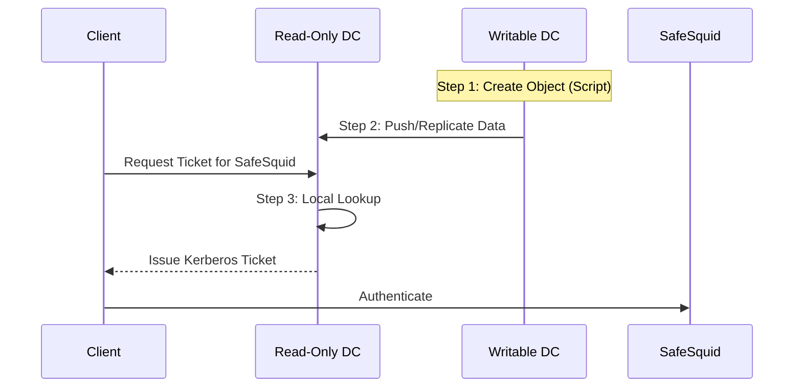

import Tabs from '@theme/Tabs';
import TabItem from '@theme/TabItem';

## Problem: Kerberos SSO in RODC Environments

In distributed networks where Read-Only Domain Controllers (RODCs) are used, direct configuration of Kerberos identities is impossible due to the read-only nature of the database. Attempts to create computer objects or modify SPNs on an RODC will fail. Users at RODC-controlled sites often face 407 authentication prompts because the RODC is "blind" to the SafeSquid computer object until it is explicitly created on a Writable DC and replicated.

## Key benefits

*   **Global Single Sign-On**: Authenticated users at RODC sites access the proxy without credential prompts.
*   **Security Alignment**: Enforces AES-256 encryption across all sites.
*   **Centralized Management**: Configure once on the Writable DC (RWDC) and replicate automatically to all RODC locations.
*   **Zero Admin Overhead**: Automation script handles complex AD attribute mapping (UAC Flags, SPNs, Encryption Types).

##  The Concept: Kerberos Lookup & the "Push"

To understand why the Main DC is vital, consider the Kerberos-RODC flow:



**Why it matters:** The RODC cannot issue a ticket unless it "knows" SafeSquid exists. Since it can't create the account itself, you must **Push** the "Source of Truth" from the **Main Writable DC**.

---

## Prerequisites
- Perform all operations on a **Writable Domain Controller** (RWDC).
- **Target the PDC Emulator**: To avoid "Referral" or "Unwilling to process" errors, we explicitly find and target the Primary DC.

```powershell
# Run this first to identify your Writable DC
$TargetDC = (Get-ADDomainController -Discover -Service PrimaryDC).HostName | Select-Object -First 1
Write-Host "Operations will be performed on: $TargetDC" -ForegroundColor Cyan
```

---

## Configuration Breakdown

### Service Principal Names (SPNs)
Seven SPNs are required. The hostname used by `msktutil` must match the AD object's registration exactly.

| Attribute | Required Value / Placeholder |
|---|---|
| **Name** | `safesquid` |
| **SamAccountName** | `safesquid$` |
| **UPN** | `safesquid.<REALM>@<REALM>` |
| **UAC Bitmask** | `33624064` (Workstation + No Expiry + No Pre-Auth) |
| **Encryption Type** | `28` (AES 128/256 Support) |

---

## Placeholder Reference Table

Use this table to identify which values in the commands and scripts need to be replaced with your environment's specific details.

| Placeholder | Description | Example Value |
| :--- | :--- | :--- |
| `<SafeSquid_ISO_Hostname>` | The hostname of your SafeSquid ISO/Virtual Machine. | `safesquid-proxy-01` |
| `<your.domain.name>` | Your Active Directory domain name (FQDN). | `company.local` |
| `<REALM>` | Your AD domain name in ALL CAPS. | `COMPANY.LOCAL` |
| `$ComputerName` | The name of the AD computer object. **Do not change this.** | `safesquid` |
| `<RODC_Hostname>` | The hostname of your Read-Only Domain Controller. | `rodc-01` |
| `<RODC_IP>` | The IP address of your Read-Only Domain Controller. | `192.168.1.10` |

---

## Service Principal Name (SPN) Reference Table

These seven SPNs must be registered on the SafeSquid computer object. Replace placeholders with your actual values.

| SPN Type | Service Principal Name Format | Description |
| :--- | :--- | :--- |
| **ISO Host (FQDN)** | `HOST/<SafeSquid_ISO_Hostname>.<REALM>` | Kerberos identity for the ISO hostname. |
| **ISO HTTP (FQDN)** | `HTTP/<SafeSquid_ISO_Hostname>.<REALM>` | Used for web-based Kerberos authentication. |
| **ISO LDAP (FQDN)** | `LDAP/<SafeSquid_ISO_Hostname>.<REALM>` | Used for LDAP/AD communication. |
| **Common Host (FQDN)**| `HOST/safesquid.<REALM>` | Kerberos identity for the common `safesquid` name. |
| **Common HTTP (FQDN)**| `HTTP/safesquid.<REALM>` | Primary SPN for proxy authentication. |
| **Common LDAP (FQDN)**| `LDAP/safesquid.<REALM>` | Used for searching AD via `safesquid` identity. |
| **Common Host (Short)**| `host/safesquid` | Short name (NetBIOS) SPN for legacy compatibility. |

---

## Setup Procedure

Choose the method that fits your administration style.

<Tabs>
<TabItem value="manual" label="Manual Steps">

### Step 1: Initialize Identity
Replace `<Placeholders>` with your environment values.

```powershell
$TargetDC = (Get-ADDomainController -Discover -Service PrimaryDC).HostName | Select-Object -First 1
$ISO_Hostname = "<SafeSquid_ISO_Hostname>"  # e.g., 'safesquid-proxy-01'
$DomainName    = "<your.domain.name>"        # e.g., 'company.local'
$Realm         = $DomainName.ToUpper()       # e.g., 'COMPANY.LOCAL'
$ComputerName  = "safesquid"
```

### Step 2: Create or Update Object
```powershell
# Attempt to create the object on the writable DC
New-ADComputer -Name $ComputerName -Server $TargetDC `
    -SamAccountName "$ComputerName$" `
    -Path "CN=Computers,DC=$($DomainName.Replace('.', ',DC='))" `
    -DNSHostName "$ComputerName.$DomainName" `
    -UserPrincipalName "$ComputerName.$Realm@$Realm" `
    -Enabled $true

# Update core attributes if object already exists
Set-ADComputer -Identity $ComputerName -Server $TargetDC `
    -DNSHostName "$ComputerName.$DomainName" `
    -UserPrincipalName "$ComputerName.$Realm@$Realm"
```

### Step 3: Register SPNs (Differential Update)
Only adds SPNs that are missing to avoid "Duplicate" errors.

```powershell
$obj = Get-ADComputer -Identity $ComputerName -Server $TargetDC -Properties servicePrincipalName

# Define the mandatory SPN list
$Desired = @(
    "HOST/$ISO_Hostname.$Realm", "HTTP/$ISO_Hostname.$Realm", "LDAP/$ISO_Hostname.$Realm",
    "HOST/$ComputerName.$Realm", "HTTP/$ComputerName.$Realm", "LDAP/$ComputerName.$Realm",
    "host/$ComputerName"
)

# Identify which ones aren't already there
$toAdd = $Desired | Where-Object { $_ -notin $obj.servicePrincipalName }

if ($toAdd) {
    Set-ADComputer -Identity $obj.DistinguishedName -Server $TargetDC -Add @{ servicePrincipalName = $toAdd }
    Write-Host "Added missing SPNs."
}
```

### Step 4: Security Flags (UAC & AES)
```powershell
Set-ADObject -Identity $obj.DistinguishedName -Server $TargetDC `
    -Replace @{
        userAccountControl              = 33624064
        'msDS-SupportedEncryptionTypes' = 28
    }
```

</TabItem>
<TabItem value="script" label="Automated Script">

### Fully Generalized AD Script
Copy-paste this into a PowerShell (Admin) terminal on a Writable DC.

#### How to Run This Script
1.  **Save the Script**: Copy the code below and save it as a file named `Replicate-ADComputer.ps1`.
2.  **Location**: Save this file directly on your **Writable Domain Controller** (RWDC/PDC Emulator).
3.  **Execute**: Open PowerShell as Administrator, navigate to the folder where you saved the script, and run it using this command:
    ```powershell
    .\Replicate-ADComputer.ps1
    ```

```powershell
# =========================================================================
# SAFESQUID MASTER AD PREPARATION SCRIPT (GENERAL)
# =========================================================================
Import-Module ActiveDirectory

# --- 1. SET YOUR VARIABLES HERE ---
$ISO_Hostname = "<SafeSquid_ISO_Hostname>" 
$DomainName    = "<your.domain.name>"
$ComputerName  = "safesquid"

# --- 2. AUTOMATED LOGIC ---
$SAMAccount = "$ComputerName$"
$Realm      = $DomainName.ToUpper()
$BaseDCPath = ($DomainName -split '\.' | ForEach-Object { "DC=$_" }) -join ','
$UPN        = "$ComputerName.$Realm@$Realm"
$DNSHostName = "$ComputerName.$DomainName"

# Target the Writable PDC Emulator
$TargetDC = (Get-ADDomainController -Discover -Service PrimaryDC).HostName | Select-Object -First 1
Write-Host "Targeting DC: $TargetDC" -ForegroundColor Cyan

# SPNs (Matching msktutil requirements)
$DesiredSPNs = @(
    "HOST/$ISO_Hostname.$Realm", "HTTP/$ISO_Hostname.$Realm", "LDAP/$ISO_Hostname.$Realm",
    "HOST/$ComputerName.$Realm", "HTTP/$ComputerName.$Realm", "LDAP/$ComputerName.$Realm",
    "host/$ComputerName"
)

# --- 3. EXECUTION ---
$Existing = Get-ADComputer -Filter "SamAccountName -eq '$SAMAccount'" -Server $TargetDC -Properties servicePrincipalName -ErrorAction SilentlyContinue

if ($Existing) {
    Write-Host "Object found, updating attributes..." -ForegroundColor Yellow
    Set-ADComputer -Identity $Existing.DistinguishedName -Server $TargetDC -DNSHostName $DNSHostName -UserPrincipalName $UPN
    # Differential SPN update
    $SPNsToAdd = $DesiredSPNs | Where-Object { $_ -notin $Existing.servicePrincipalName }
    if ($SPNsToAdd) { Set-ADComputer -Identity $Existing.DistinguishedName -Server $TargetDC -Add @{ servicePrincipalName = $SPNsToAdd } }
} else {
    Write-Host "Creating new computer object..." -ForegroundColor Cyan
    New-ADComputer -Name $ComputerName -Server $TargetDC -Path "CN=Computers,$BaseDCPath" -DNSHostName $DNSHostName -UserPrincipalName $UPN -ServicePrincipalNames $DesiredSPNs -Enabled $true
}

# Apply Security Flags (UAC 33624064 + AES-256 Support)
$FinalObj = Get-ADComputer -Identity $ComputerName -Server $TargetDC
Set-ADObject -Identity $FinalObj.DistinguishedName -Server $TargetDC -Replace @{
    userAccountControl              = 33624064
    'msDS-SupportedEncryptionTypes' = 28
}

Write-Host "`nSUCCESS: Active Directory is now configured for SafeSquid." -ForegroundColor Green
```

</TabItem>
</Tabs>


---

## Phase 2: Configure Password Replication Policy (PRP)

Since the RODC is read-only, you must allow it to cache the SafeSquid computer password.

1.  Open **AD Users and Computers** > **Domain Controllers** OU.
2.  Right-click your **RODC** Object > **Properties**.
3.  Go to the **Password Replication Policy** tab.
4.  Click **Add** and select the **safesquid** computer account.
5.  Ensure it is set to **"Allowed"**.

---

## Phase 3: SafeSquid Interface Setup

Navigate to **Application Setup** > **Integrate LDAP** > **LDAP servers**.


| Parameter | Configuration Value |
| :--- | :--- |
| **Enabled** | `TRUE` |
| **Ldap FQDN\IP** | `` `<RODC_Hostname>\<RODC_IP>` `` |
| **Ldap Bind Method** | `NEGOTIATE_LDAP_AUTH` |
| **Ldap Username** | `` `administrator@<your_domain>` `` |
| **Ldap Basedn** | `` `dc=<domain_part1>,dc=<domain_part2>` `` |
| **Ldap Domain** | `` `<your_domain>` `` |

:::warning
Ensure the **Ldap Bind Method** is set to **NEGOTIATE_LDAP_AUTH**. This is the trigger that initiates Kerberos ticket exchange.
:::

---

## Troubleshooting

### Keytab Generation Fails
*   **Symptom**: Logs show `kerberos: main: Generate Keytab: failed`.
*   **Cause**: The RODC password replication policy hasn't synced the computer account yet.
*   **Fix**: Manually initiate a sync on the RODC or wait 15 minutes.

### 407 Proxy Authentication Required
*   **Cause**: Time drift between AD and SafeSquid.
*   **Fix**: Verify time sync using the `date` command on both servers. They must be within 5 minutes of each other.