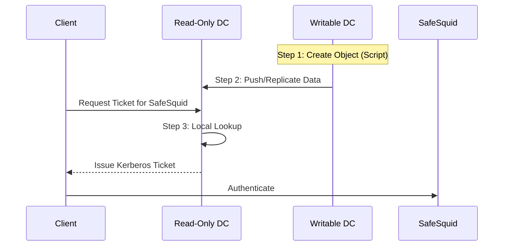

import Tabs from '@theme/Tabs';
import TabItem from '@theme/TabItem';

## Problem: Kerberos SSO in RODC Environments

In distributed networks where Read-Only Domain Controllers (RODCs) are used, direct configuration of Kerberos identities is impossible due to the read-only nature of the database. Attempts to create computer objects or modify SPNs on an RODC will fail. Users at RODC-controlled sites often face 407 authentication prompts because the RODC is "blind" to the SafeSquid computer object until it is explicitly created on a Writable DC and replicated.

## Key benefits

*   **Global Single Sign-On**: Authenticated users at RODC sites access the proxy without credential prompts.
*   **Security Alignment**: Enforces AES-256 encryption across all sites.
*   **Centralized Management**: Configure once on the Writable DC (RWDC) and replicate automatically to all RODC locations.
*   **Zero Admin Overhead**: Automation script handles complex AD attribute mapping (UAC Flags, SPNs, Encryption Types).

## 🔍 The Concept: Kerberos Lookup & the "Push"

To understand why the Main DC is vital, consider the Kerberos-RODC flow:



**Why it matters:** The RODC cannot issue a ticket unless it "knows" SafeSquid exists. Since it can't create the account itself, you must **Push** the "Source of Truth" from the **Main Writable DC**.

---

## Prerequisites
*   Access to a **Writable Domain Controller (RWDC)** (e.g., 10.200.2.53).
*   Hostname and IP of the **Read-Only Domain Controller (RODC)** (e.g., 10.200.2.54).
*   Active Directory PowerShell Module installed.

---

## Setup Procedure: Active Directory Preparation (On RWDC)

Perform these steps on your **Main Writable DC**. Choose your preferred method below:

<Tabs>
<TabItem value="script" label="🚀 Automated Script (Recommended)">

### Step-by-Step Execution:
1. Log into your **Writable DC**.
2. Open **PowerShell (Admin)**.
3. Paste the script below, replacing the `<placeholders>` with your values.

```powershell
# =========================================================================
# SAFESQUID AD PREPARATION SCRIPT
# =========================================================================

# 1. SET YOUR VARIABLES
$SafesquidHostname = "<Your_SafeSquid_Hostname>"
$DomainName = "<Your_Domain_Name>"
$ComputerName = "safesquid"

# 2. AUTOMATED LOGIC (LDAP PATH & SPNS)
$BaseDCPath = "DC=" + $DomainName.Replace(".", ",DC=")
$Container = "CN=Computers,$BaseDCPath"
$DNSHostName = "$SafesquidHostname.$DomainName"

$SPNs = @(
    "HOST/$SafesquidHostname.$DomainName",
    "LDAP/$SafesquidHostname.$DomainName",
    "HTTP/$SafesquidHostname.$DomainName",
    "HOST/$ComputerName.$DomainName",
    "LDAP/$ComputerName.$DomainName",
    "HTTP/$ComputerName.$DomainName"
)

# 3. IDENTITY CHECK & CREATION
Import-Module ActiveDirectory
$Existing = Get-ADComputer -Filter "Name -eq '$ComputerName'" -ErrorAction SilentlyContinue

if ($Existing) {
    Set-ADComputer -Identity $Existing.DistinguishedName -Replace @{servicePrincipalName = $SPNs} -DNSHostName $DNSHostName
} else {
    New-ADComputer -Name $ComputerName -Path $Container -DNSHostName $DNSHostName -ServicePrincipalNames $SPNs -Enabled $true
}

# 4. SECURITY & ENCRYPTION (AES-256)
$Target = Get-ADComputer -Filter "Name -eq '$ComputerName'"
Set-ADAccountControl -Identity $Target.DistinguishedName -TrustedForDelegation $true -PasswordNeverExpires $true
Set-ADComputer -Identity $Target.DistinguishedName -Replace @{'msDS-SupportedEncryptionTypes' = 28}

Write-Host "Success: Active Directory is now configured for SafeSquid Kerberos." -ForegroundColor Green
```

</TabItem>
<TabItem value="manual" label="🛠️ Manual PowerShell Deep-Dive">

### Manual Execution Guide
Each command below performs a mandatory update to the AD Schema.

**1. Define the Identity**
```powershell
$SafesquidHostname = "<Hostname>"; $DomainName = "<Domain>"; $ComputerName = "safesquid"
```
*   **Goal**: Stores names in memory to ensure consistency.

**2. Calculate the LDAP Path**
```powershell
$BaseDCPath = "DC=" + $DomainName.Replace(".", ",DC=")
$Container = "CN=Computers,$BaseDCPath"
```
*   **Goal**: Turns dots into commas so AD can locate the "Computers" OU.

**3. Register SPNs**
```powershell
$SPNs = @("HOST/...", "HTTP/...", "LDAP/...")
```
*   **Goal**: Assigns the "Name Tags" that allow browsers to request tickets for the proxy.

**4. Identity Creation & Trust**
```powershell
Set-ADAccountControl -Identity $ComputerName -TrustedForDelegation $true
Set-ADComputer -Identity $ComputerName -Replace @{'msDS-SupportedEncryptionTypes' = 28}
```
*   **Goal**: Grants "Delegation" trust and forces **AES 128/256 Encryption** (required for modern browsers).

</TabItem>
</Tabs>

---

## Phase 2: Configure Password Replication Policy (PRP)

Since the RODC is read-only, you must allow it to cache the SafeSquid computer password.

1.  Open **AD Users and Computers** > **Domain Controllers** OU.
2.  Right-click your **RODC** Object > **Properties**.
3.  Go to the **Password Replication Policy** tab.
4.  Click **Add** and select the **safesquid** computer account.
5.  Ensure it is set to **"Allowed"**.

---

## Phase 3: SafeSquid Interface Setup

Navigate to **Application Setup** > **Integrate LDAP** > **LDAP servers**.

| Parameter | Configuration Value |
| :--- | :--- |
| **Enabled** | `TRUE` |
| **Ldap FQDN\IP** | `` `<RODC_Hostname>\<RODC_IP>` `` |
| **Ldap Bind Method** | `NEGOTIATE_LDAP_AUTH` |
| **Ldap Username** | `` `administrator@<your_domain>` `` |
| **Ldap Basedn** | `` `dc=<domain_part1>,dc=<domain_part2>` `` |
| **Ldap Domain** | `` `<your_domain>` `` |

:::warning
Ensure the **Ldap Bind Method** is set to **NEGOTIATE_LDAP_AUTH**. This is the trigger that initiates Kerberos ticket exchange.
:::

---

## Troubleshooting

### Keytab Generation Fails
*   **Symptom**: Logs show `kerberos: main: Generate Keytab: failed`.
*   **Cause**: The RODC password replication policy hasn't synced the computer account yet.
*   **Fix**: Manually initiate a sync on the RODC or wait 15 minutes.

### 407 Proxy Authentication Required
*   **Cause**: Time drift between AD and SafeSquid.
*   **Fix**: Verify time sync using the `date` command on both servers. They must be within 5 minutes of each other.

**Related:** [Simple Authentication](Simple_Authentication), [Setup Active Directory Integration](Setup_Active_Directory_Integration), [Troubleshooting](/docs/Troubleshooting/main/)

