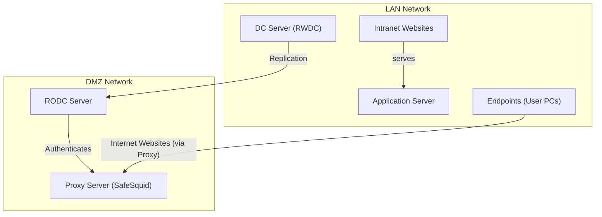

import Tabs from '@theme/Tabs';
import TabItem from '@theme/TabItem';

## Problem: Kerberos SSO in RODC Environments

Many organizations have offices and remote sites spread across different locations. 
Setting up a full Domain Controller (DC) at each of these sites is risky if someone gains unauthorized access to it, they could compromise the entire network. 
But without a local DC, every login request has to travel back to the main server over the WAN, which is slow, unreliable, and leaves users unable to work if the connection goes down.

This problem becomes more complex when SafeSquid SWG is deployed at these remote sites or in a DMZ to enforce web access policies.
SafeSquid authenticates users against Active Directory to apply role-based web access controls and log internet activity per user. 
Without a local DC or RODC available, SafeSquid cannot resolve user identities in real time meaning access policies fall back to IP-based rules, losing the granular, user-level control that makes SafeSquid effective.

When an RODC is placed in a DMZ alongside SafeSquid, the risk increases further the DMZ is exposed to higher threats by design, and any directory controller placed there becomes a potential target.

The challenge is deploying a solution that gives SafeSquid reliable, real-time access to user identity and group membership at every site without exposing writable directory data to compromise.

:::warning
The RODC **cannot** create computer objects or register SPNs by itself. All AD preparation **must be done on the Writable DC (RWDC)**, then pushed to the RODC through replication.
:::

---

## Benefits of Using RODC with SafeSquid SWG

**Reliable User Authentication for SafeSquid**

SafeSquid authenticates users against Active Directory to enforce role and group-based web access policies. 
An RODC at the local site ensures SafeSquid can resolve user identities without depending on a WAN connection to the central DC. 
Authentication stays fast and available, even when the link to headquarters is slow or down.

**Role-Based Web Access That Actually Works**

SafeSquid's strength lies in applying different web access policies based on who the user is and what group they belong to. This only works when user identity can be confirmed in real time. 
An RODC provides that identity data locally, allowing SafeSquid to enforce precise, role-based policies blocking or allowing web categories based on job function, department, or shift timing.

**Contained Risk in the DMZ**

When SafeSquid is deployed in a DMZ to inspect and control traffic for external-facing services, an RODC can sit alongside it to handle authentication requests. 
Because the RODC is read-only, a compromise in the DMZ cannot be used to modify directory data or push changes back to the main domain limiting the blast radius of any breach.

**Accurate Activity Logging Per User**

SafeSquid logs every web request against the authenticated user identity. Without a local DC, this logging degrades to IP addresses, making reports far less useful for IT administrators and HR managers. 
With an RODC in place, SafeSquid maintains accurate, user-attributed logs across all remote sites supporting policy enforcement, compliance audits, and usage analysis.

**Delegated Administration Without Full Privileges**

RODC's Administrator Role Separation allows local staff at a branch office to manage the RODC without being granted domain admin rights. 
This pairs well with SafeSquid's own role-based policy management both tools allow centralized IT teams to set policy while giving local staff limited, safe operational control.

**Consistent Security Posture Across All Sites**

With an RODC supporting SafeSquid at every remote location, the same web security policies, user authentication rules, and access controls apply everywhere whether at headquarters, a branch office, or through a DMZ-facing gateway. 
There are no gaps where users fall outside policy simply because the WAN was unavailable or a local DC was missing.

---

## Advantages: Why This Architecture Uses an RODC in the DMZ

This problem is specific to a well-established enterprise security pattern - the **LAN + DMZ split** - where the proxy server is intentionally placed outside the trusted internal network.



| Component | Location | Role |
| :--- | :--- | :--- |
| **DC Server (RWDC)** | LAN | Authoritative, writable Active Directory server. All identity creation happens here. |
| **Endpoints (User PCs)** | LAN | Corporate workstations joined to the AD domain. Users log in with domain credentials. |
| **RODC Server** | DMZ | Read-only AD replica in the DMZ. Can authenticate users locally but **cannot write to AD**. |
| **Proxy Server (SafeSquid)** | DMZ | Intercepts all outbound internet traffic and enforces authentication, policies, and filtering. |


**Why an RODC instead of a full DC in the DMZ?**
Placing a full Writable DC in the DMZ would expose the entire AD identity store to the internet-facing network - a critical security risk. The RODC is the correct choice because:
- It can **verify** Kerberos tickets - but only for accounts it has cached via the Password Replication Policy.
- It **cannot accept write operations** - protecting the AD database even if the DMZ is compromised.
- It holds only a **partial, controlled subset** of AD data limiting the blast radius of any breach.

---

## How to Integrate SafeSquid with RODC

The fix is a three-phase process:

| Phase | What You Do | Where |
| :--- | :--- | :--- |
| **Phase 1** | Create the SafeSquid computer object + SPNs in Active Directory | On the **Writable DC (RWDC)** |
| **Phase 2** | Allow the RODC to cache the SafeSquid account via Password Replication Policy | On the **RWDC** (AD Users & Computers) |
| **Phase 3** | Point SafeSquid's LDAP configuration to the RODC using `NEGOTIATE_LDAP_AUTH` | In the **SafeSquid web interface** |

Once the SafeSquid object is created and replicated, this is the complete authentication flow:

## How Kerberos SSO Works in This Setup


**Why this flow requires both the RWDC and RODC:**

| Stage | Who Does It | Why |
| :--- | :--- | :--- |
| Create SafeSquid object + SPNs | **Writable DC (RWDC)** | Only the RWDC can write to Active Directory |
| Cache the identity | **RODC** | Receives replicated data from RWDC |
| Issue Kerberos ticket | **RODC** | Serves users locally in the DMZ, fast and secure |
| Validate ticket at proxy | **SafeSquid → RODC** | LDAP bind confirms the user's ticket is genuine |

---

## Prerequisites

Before beginning, ensure the following:

- You have **Administrator access** to a **Writable Domain Controller (RWDC)**.
- You know the **hostname and IP** of your **RODC** (the one in the DMZ).
- You know the **hostname** of your **SafeSquid proxy VM/ISO**.
- The **Active Directory PowerShell module** is installed on the RWDC.
- SafeSquid and the RODC are **network-reachable from each other** (firewall allows LDAP port 389/636).

Run this on the RWDC first to confirm you're targeting the PDC Emulator:

```powershell
# Run this first to identify your Writable DC
$TargetDC = (Get-ADDomainController -Discover -Service PrimaryDC).HostName | Select-Object -First 1
Write-Host "Operations will be performed on: $TargetDC" -ForegroundColor Cyan
```

---

## Placeholder Reference Table

Use this table to identify which values in the commands and scripts need to be replaced with your environment's specific details.

| Placeholder | Description | Example Value | Command to Find It |
| :--- | :--- | :--- | :--- |
| `<ProxyHostname>` | Hostname of your SafeSquid proxy VM/machine. | `proxy-01` | Run `hostname` on the SafeSquid machine |
| `<your.domain.name>` | Your Active Directory domain name (FQDN). | `company.local` | `(Get-ADDomain).DNSRoot` |
| `<REALM>` | Your AD domain name in ALL CAPS. | `COMPANY.LOCAL` | `(Get-ADDomain).DNSRoot.ToUpper()` |
| `$ComputerName` | The name of the AD computer object. **Do not change this.** | `safesquid` | Fixed value — do not look up |
| `<RODC_Hostname>` | Hostname of your Read-Only Domain Controller. | `rodc-01` | `Get-ADDomainController -Filter {IsReadOnly -eq $true} \| Select-Object HostName` |
| `<RODC_IP>` | IP address of your Read-Only Domain Controller. | `192.168.1.10` | `Get-ADDomainController -Filter {IsReadOnly -eq $true} \| Select-Object IPv4Address` |

---

## AD Object Configuration Reference

### Computer Object Attributes

| Attribute | Required Value | Notes |
|---|---|---|
| **Name** | `safesquid` | Fixed - do not change |
| **SamAccountName** | `safesquid$` | `$` suffix is the AD computer account convention |
| **UPN** | `safesquid.<REALM>@<REALM>` | e.g., `safesquid.COMPANY.LOCAL@COMPANY.LOCAL` |
| **UAC Bitmask** | `33624064` | `WORKSTATION_TRUST` + `DONT_EXPIRE_PASSWORD` + `PARTIAL_SECRETS` (RODC-compatible) |
| **Encryption Type** | `28` | RC4 (4) + AES-128 (8) + AES-256 (16) - supports all modern ciphers |

### Required Service Principal Names (SPNs)

These seven SPNs must be registered on the SafeSquid computer object. They cover both the VM's actual hostname and the common `safesquid` identity.

| SPN Type | Format | Example Value | Purpose |
| :--- | :--- | :--- | :--- |
| **Proxy Host (FQDN)** | `HOST/<ProxyHostname>.<REALM>` | `HOST/proxy-01.COMPANY.LOCAL` | Kerberos machine identity - required by `msktutil` for keytab generation |
| **Proxy HTTP (FQDN)** | `HTTP/<ProxyHostname>.<REALM>` | `HTTP/proxy-01.COMPANY.LOCAL` | Browser ticket requests using the actual VM hostname |
| **Proxy LDAP (FQDN)** | `LDAP/<ProxyHostname>.<REALM>` | `LDAP/proxy-01.COMPANY.LOCAL` | LDAP bind using the actual VM hostname |
| **Common Host (FQDN)** | `HOST/safesquid.<REALM>` | `HOST/safesquid.COMPANY.LOCAL` | Kerberos identity for the common `safesquid` name |
| **Common HTTP (FQDN)** | `HTTP/safesquid.<REALM>` | `HTTP/safesquid.COMPANY.LOCAL` | **Primary SPN** - used when browser connects via PAC file |
| **Common LDAP (FQDN)** | `LDAP/safesquid.<REALM>` | `LDAP/safesquid.COMPANY.LOCAL` | LDAP searching via the common `safesquid` identity |
| **Common Host (Short)** | `host/safesquid` | `host/safesquid` | Short/NetBIOS form - legacy Windows client compatibility |

## Verify Registered SPNs

Run this command on the **Writable DC** to check which SPNs are currently registered on the safesquid computer object:

```powershell
Get-ADComputer safesquid -Properties servicePrincipalName | Select-Object -ExpandProperty servicePrincipalName
```

---

## Phase 1: Active Directory Preparation (on the RWDC)

Perform these steps on your **Writable Domain Controller**. Choose your preferred method:

<Tabs>
<TabItem value="manual" label="Manual Steps">

### Step 1: Initialize Identity
Replace `<Placeholders>` with your environment values.

```powershell
$TargetDC      = (Get-ADDomainController -Discover -Service PrimaryDC).HostName | Select-Object -First 1
$ProxyHostname = "<ProxyHostname>"           # e.g., 'proxy-01' (your SafeSquid VM hostname)
$DomainName    = "<your.domain.name>"        # e.g., 'company.local'
$Realm         = $DomainName.ToUpper()       # e.g., 'COMPANY.LOCAL'
$ComputerName  = "safesquid"                 # Do NOT change this
```

### Step 2: Create or Update Object
```powershell
# Attempt to create the object on the writable DC
New-ADComputer -Name $ComputerName -Server $TargetDC `
    -SamAccountName "$ComputerName$" `
    -Path "CN=Computers,DC=$($DomainName.Replace('.', ',DC='))" `
    -DNSHostName "$ComputerName.$DomainName" `
    -UserPrincipalName "$ComputerName.$Realm@$Realm" `
    -Enabled $true

# Update core attributes if object already exists
Set-ADComputer -Identity $ComputerName -Server $TargetDC `
    -DNSHostName "$ComputerName.$DomainName" `
    -UserPrincipalName "$ComputerName.$Realm@$Realm"
```

### Step 3: Register SPNs (Differential Update)
Only adds SPNs that are missing to avoid "Duplicate" errors.

```powershell
$obj = Get-ADComputer -Identity $ComputerName -Server $TargetDC -Properties servicePrincipalName

# Define the mandatory SPN list
$Desired = @(
    "HOST/$ProxyHostname.$Realm", "HTTP/$ProxyHostname.$Realm", "LDAP/$ProxyHostname.$Realm",
    "HOST/$ComputerName.$Realm", "HTTP/$ComputerName.$Realm", "LDAP/$ComputerName.$Realm",
    "host/$ComputerName"
)

# Identify which ones aren't already there
$toAdd = $Desired | Where-Object { $_ -notin $obj.servicePrincipalName }

if ($toAdd) {
    Set-ADComputer -Identity $obj.DistinguishedName -Server $TargetDC -Add @{ servicePrincipalName = $toAdd }
    Write-Host "Added missing SPNs."
}
```

### Step 4: Security Flags (UAC & AES)
```powershell
Set-ADObject -Identity $obj.DistinguishedName -Server $TargetDC `
    -Replace @{
        userAccountControl              = 33624064
        'msDS-SupportedEncryptionTypes' = 28
    }
```

</TabItem>
<TabItem value="script" label="Automated Script">

### Fully Generalized AD Script

#### How to Run This Script
1.  **Save the Script**: Copy the code below and save it as `Replicate-ADComputer.ps1`.
2.  **Location**: Save this file directly on your **Writable Domain Controller (RWDC/PDC Emulator)**.
3.  **Edit Variables**: Open the file and fill in your values under `SET YOUR VARIABLES HERE`.
4.  **Execute**: Open PowerShell as Administrator and run:
    ```powershell
    Set-ExecutionPolicy -ExecutionPolicy Bypass -Scope Process; .\Replicate-ADComputer.ps1
    ```

```powershell
# =========================================================================
# SAFESQUID MASTER AD PREPARATION SCRIPT (GENERAL)
# =========================================================================
Import-Module ActiveDirectory

# --- 1. SET YOUR VARIABLES HERE ---
$ProxyHostname = "<ProxyHostname>"            # e.g., 'proxy-01' (your SafeSquid VM hostname)
$DomainName    = "<your.domain.name>"         # e.g., 'company.local'
$ComputerName  = "safesquid"                  # Do NOT change this

# --- 2. AUTOMATED LOGIC ---
$SAMAccount  = "$ComputerName$"
$Realm       = $DomainName.ToUpper()
$BaseDCPath  = ($DomainName -split '\.' | ForEach-Object { "DC=$_" }) -join ','
$UPN         = "$ComputerName.$Realm@$Realm"
$DNSHostName = "$ComputerName.$DomainName"

# Target the Writable PDC Emulator
$TargetDC = (Get-ADDomainController -Discover -Service PrimaryDC).HostName | Select-Object -First 1
Write-Host "Targeting DC: $TargetDC" -ForegroundColor Cyan

# SPNs (Matching msktutil requirements)
$DesiredSPNs = @(
    "HOST/$ProxyHostname.$Realm", "HTTP/$ProxyHostname.$Realm", "LDAP/$ProxyHostname.$Realm",
    "HOST/$ComputerName.$Realm", "HTTP/$ComputerName.$Realm", "LDAP/$ComputerName.$Realm",
    "host/$ComputerName"
)

# --- 3. EXECUTION ---
$Existing = Get-ADComputer -Filter "SamAccountName -eq '$SAMAccount'" -Server $TargetDC -Properties servicePrincipalName -ErrorAction SilentlyContinue

if ($Existing) {
    Write-Host "Object found, updating attributes..." -ForegroundColor Yellow
    Set-ADComputer -Identity $Existing.DistinguishedName -Server $TargetDC -DNSHostName $DNSHostName -UserPrincipalName $UPN
    # Differential SPN update - only adds missing SPNs to avoid "Duplicate" errors
    $SPNsToAdd = $DesiredSPNs | Where-Object { $_ -notin $Existing.servicePrincipalName }
    if ($SPNsToAdd) { Set-ADComputer -Identity $Existing.DistinguishedName -Server $TargetDC -Add @{ servicePrincipalName = $SPNsToAdd } }
    Write-Host "SPNs updated." -ForegroundColor Green
} else {
    Write-Host "Creating new computer object..." -ForegroundColor Cyan
    New-ADComputer -Name $ComputerName -Server $TargetDC -Path "CN=Computers,$BaseDCPath" -DNSHostName $DNSHostName -UserPrincipalName $UPN -ServicePrincipalNames $DesiredSPNs -Enabled $true
}

# Apply Security Flags (UAC 33624064 + AES-256 Support)
$FinalObj = Get-ADComputer -Identity $ComputerName -Server $TargetDC
Set-ADObject -Identity $FinalObj.DistinguishedName -Server $TargetDC -Replace @{
    userAccountControl              = 33624064
    'msDS-SupportedEncryptionTypes' = 28
}

Write-Host "`nSUCCESS: Active Directory is now configured for SafeSquid." -ForegroundColor Green
```

</TabItem>
</Tabs>

---

## Phase 2: Configure Password Replication Policy (PRP)

Since the RODC is read-only, you must explicitly allow it to **cache the SafeSquid computer account password**. Without this step, the RODC will always refer ticket requests back to the RWDC introducing latency and potential failures.

1.  Open **Active Directory Users and Computers** on the RWDC.
2.  Navigate to the **Domain Controllers** OU.
3.  Right-click your **RODC** object → **Properties**.
4.  Go to the **Password Replication Policy** tab.
5.  Click **Add** → select the **safesquid** computer account.
6.  Ensure it is set to **"Allowed"**.

:::note
After adding the policy, wait up to 15 minutes for initial replication, or trigger a manual sync using `repadmin /syncall` on the RWDC.
:::

---

## Phase 3: SafeSquid Interface Setup

With the AD object in place and the RODC caching the safesquid identity, configure SafeSquid to authenticate against the RODC.

Navigate to **Application Setup** → **Integrate LDAP** → **LDAP servers**.


| Parameter | Configuration Value |
| :--- | :--- |
| **Enabled** | `TRUE` |
| **Ldap FQDN\IP** | `<RODC_Hostname>` or `<RODC_IP>` |
| **Ldap Bind Method** | `NEGOTIATE_LDAP_AUTH` |
| **Ldap Username** | `administrator@<your.domain.name>` |
| **Ldap Basedn** | `dc=<domain_part1>,dc=<domain_part2>` |
| **Ldap Domain** | `<your.domain.name>` |

:::warning
The **Ldap Bind Method** must be set to **NEGOTIATE_LDAP_AUTH**. This is what triggers the Kerberos ticket exchange instead of basic LDAP bind it is the core of SSO functionality.
:::

### Verification: Confirm LDAP is Working

Once the LDAP configuration is saved and SafeSquid successfully binds to the RODC, navigate to the **LDAP Entries** tab (next to **LDAP servers**).

If the setup is successful, SafeSquid will populate the LDAP Entries table with user and computer objects fetched from Active Directory:


| Column | What It Shows |
| :--- | :--- |
| **Login Attribute** | The user or computer account UPN (e.g., `ADMINISTRATOR@SAFESQUID.INTRANET`) |
| **LDAP Domain** | The Distinguished Name path of the object in AD (e.g., `CN=Administrator,CN=Users,...`) |
| **LDAP Profiles** | The AD groups the user belongs to used by SafeSquid for role-based policy matching |

:::note
If the **LDAP Entries** tab is **empty** after saving, the LDAP bind has failed. Double-check the RODC hostname/IP, the `Ldap Username` credentials, and confirm the RODC's Password Replication Policy includes the `safesquid` account.
:::

---

## Troubleshooting

### Keytab Generation Fails
*   **Symptom**: SafeSquid logs show `kerberos: main: Generate Keytab: failed`.
*   **Cause**: The RODC's Password Replication Policy hasn't cached the SafeSquid account yet.
*   **Fix**: Trigger manual AD replication with `repadmin /syncall /AdeP` on the RWDC, or wait 15 minutes.

### 407 Proxy Authentication Required (After Setup)
*   **Cause 1 - Time Drift**: Kerberos requires clocks to be within 5 minutes of each other. Check time sync with `date` on all servers.
*   **Cause 2 - SPN Mismatch**: The browser is requesting a ticket for a hostname that isn't registered as an SPN. Verify all 7 SPNs are present with `Get-ADComputer safesquid -Properties servicePrincipalName`.
*   **Cause 3 - PRP Not Set**: The RODC doesn't have the password cached. Verify the Password Replication Policy includes the `safesquid` account.

### RODC Refers Requests to RWDC ("Referral" Error)
*   **Cause**: The RODC received an account request it can't serve locally, so it redirects to the RWDC.
*   **Fix**: Ensure the PRP is configured as described in Phase 2, and allow sufficient replication time.

---

**Related:** [Simple Authentication](Simple_Authentication) | [Setup Active Directory Integration](Setup_Active_Directory_Integration) | [Troubleshooting](/docs/Troubleshooting/main/)
