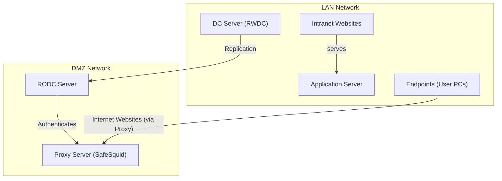
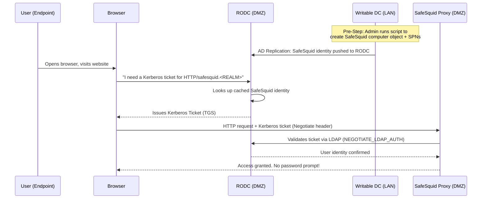

import Tabs from '@theme/Tabs';
import TabItem from '@theme/TabItem';

## Overview

If your organization has offices at multiple locations, you face a common problem: setting up a full Domain Controller (DC) at every site is risky, but without one, every login request has to go back to the main server over the internet. This is slow and unreliable.

When SafeSquid SWG is running at your remote sites or in a DMZ, it checks user identity against Active Directory before applying web access rules. If there is no local DC available, SafeSquid can only use IP addresses to identify users. This means you lose the ability to control access based on who the person is.

Placing an RODC in the DMZ next to SafeSquid fixes this. Logins are handled locally and quickly, and because the RODC is read-only, attackers cannot use it to make changes to your directory even if they break into the DMZ.

:::warning
The RODC **cannot** create computer objects or register SPNs on its own. All setup work **must be done on the main Writable DC (RWDC)** first, and then it gets copied to the RODC automatically.
:::

---

## Benefits of Using RODC with SafeSquid SWG

- **Reliable Authentication:** SafeSquid can look up who users are locally, without needing a connection to your main DC.
- **Role-Based Web Access:** The RODC gives SafeSquid up-to-date information about which groups users belong to, so it can apply the right access rules for each person or department.
- **Contained DMZ Risk:** Because the RODC can only read data and never write it, even if your DMZ is attacked, no changes can be pushed to your main domain.
- **Accurate Per-User Logging:** SafeSquid records web activity against real user accounts instead of just IP addresses, which helps with audits and compliance reporting.
- **Delegated Administration:** Your local IT staff can manage the RODC without needing full admin rights over the entire domain, just like how SafeSquid lets you give staff limited management access.
- **Consistent Security Across All Sites:** The same access rules apply everywhere in your organization, whether staff are at head office, a branch, or working through the DMZ.

---

## Why This Architecture Uses an RODC in the DMZ

This setup follows the **LAN + DMZ split** pattern, where your proxy sits outside the main internal network on purpose. It acts as a barrier between your users and the internet.



| Component | Location | Role |
| :--- | :--- | :--- |
| **DC Server (RWDC)** | LAN | The main Active Directory server. This is where all user and computer accounts are created and managed. |
| **Endpoints (User PCs)** | LAN | Your staff's computers, connected to the domain. Users sign in with their domain accounts. |
| **RODC Server** | DMZ | A read-only copy of Active Directory. It can verify user logins locally but **cannot make any changes to AD**. |
| **Proxy Server (SafeSquid)** | DMZ | Sits between your users and the internet. Checks who users are and applies web access rules before letting traffic through. |

Putting a full writable DC in your DMZ would be dangerous. It would give attackers access to your entire user database if they broke in. The RODC is the right choice because it can check Kerberos tickets for users it knows about, cannot be used to change anything in AD, and only holds a small, controlled portion of your directory data.

---

## How to Integrate SafeSquid with RODC

| Phase | What You Do | Where |
| :--- | :--- | :--- |
| **Phase 1** | Create a computer account for SafeSquid in Active Directory, and register its service names (SPNs) | On the **Writable DC (RWDC)** |
| **Phase 2** | Tell the RODC it is allowed to store the SafeSquid account's password locally | On the **RWDC** (AD Users & Computers) |
| **Phase 3** | Point SafeSquid to the RODC so it can verify user logins | In the **SafeSquid web interface** |

## How Kerberos SSO Works in This Setup



| Stage | Who Does It | Why |
| :--- | :--- | :--- |
| Create SafeSquid object + SPNs | **Writable DC (RWDC)** | Only the main DC can create or change accounts in Active Directory |
| Store the identity locally | **RODC** | Gets a copy of the SafeSquid account from the main DC so it can work independently |
| Issue a login ticket | **RODC** | Handles login requests for your users directly in the DMZ. Fast and does not depend on the main DC |
| Check the ticket at the proxy | **SafeSquid → RODC** | SafeSquid asks the RODC to confirm the ticket is valid before allowing access |

---

## Prerequisites

Before you start, make sure you have the following ready:

- **Admin access** to your main Writable Domain Controller (RWDC).
- The **hostname and IP address** of your RODC (the one in the DMZ).
- The **hostname** of the server where SafeSquid is installed.
- The **Active Directory PowerShell module** installed on your RWDC.
- SafeSquid and your RODC can **talk to each other over the network** (firewall must allow LDAP on port 389 or 636).

Run this on your RWDC to make sure you are connected to the right DC before starting:

```powershell
$TargetDC = (Get-ADDomainController -Discover -Service PrimaryDC).HostName | Select-Object -First 1
Write-Host "Operations will be performed on: $TargetDC" -ForegroundColor Cyan
```

---

## Placeholder Reference Table

The scripts and commands in this guide use placeholders that you need to replace with values from your own environment. Use the table below to find each value.

| Placeholder | What It Means | Example | How to Find It |
| :--- | :--- | :--- | :--- |
| `<ProxyHostname>` | The name of the server where SafeSquid is installed. | `proxy-01` | Run `hostname` on the SafeSquid machine |
| `<your.domain.name>` | Your Active Directory domain name. | `company.local` | `(Get-ADDomain).DNSRoot` |
| `<REALM>` | Your domain name in ALL CAPS. | `COMPANY.LOCAL` | `(Get-ADDomain).DNSRoot.ToUpper()` |
| `$ComputerName` | The AD account name for SafeSquid. **Do not change this.** | `safesquid` | Fixed value. Do not look up |
| `<RODC_Hostname>` | The name of your RODC server. | `rodc-01` | `Get-ADDomainController -Filter {IsReadOnly -eq $true} \| Select-Object HostName` |
| `<RODC_IP>` | The IP address of your RODC server. | `192.168.1.10` | `Get-ADDomainController -Filter {IsReadOnly -eq $true} \| Select-Object IPv4Address` |

---

## AD Object Configuration Reference

### Computer Object Attributes

| Attribute | Required Value | Notes |
|---|---|---|
| **Name** | `safesquid` | Fixed. Do not change |
| **SamAccountName** | `safesquid$` | The `$` at the end is standard for all computer accounts in AD |
| **UPN** | `safesquid.<REALM>@<REALM>` | e.g., `safesquid.COMPANY.LOCAL@COMPANY.LOCAL` |
| **UAC Bitmask** | `33624064` | Marks this as a workstation account with a non-expiring password, compatible with RODC |
| **Encryption Type** | `28` | Supports RC4 (4) + AES-128 (8) + AES-256 (16). Covers all modern Windows clients |

### Required Service Principal Names (SPNs)

SPNs are labels that tell Active Directory what services this account provides. Windows uses them to know which account to issue a Kerberos ticket for. All seven SPNs below must be registered on the SafeSquid computer account.

| SPN Type | Format | Example Value | Purpose |
| :--- | :--- | :--- | :--- |
| **Proxy Host (FQDN)** | `HOST/<ProxyHostname>.<REALM>` | `HOST/proxy-01.COMPANY.LOCAL` | Required by `msktutil` when generating the keytab file |
| **Proxy HTTP (FQDN)** | `HTTP/<ProxyHostname>.<REALM>` | `HTTP/proxy-01.COMPANY.LOCAL` | Used when a browser requests a ticket using the actual server hostname |
| **Proxy LDAP (FQDN)** | `LDAP/<ProxyHostname>.<REALM>` | `LDAP/proxy-01.COMPANY.LOCAL` | Used for LDAP connections using the actual server hostname |
| **Common Host (FQDN)** | `HOST/safesquid.<REALM>` | `HOST/safesquid.COMPANY.LOCAL` | Kerberos identity under the shared `safesquid` name |
| **Common HTTP (FQDN)** | `HTTP/safesquid.<REALM>` | `HTTP/safesquid.COMPANY.LOCAL` | **Main SPN.** Used when browsers connect through a PAC file pointing to `safesquid` |
| **Common LDAP (FQDN)** | `LDAP/safesquid.<REALM>` | `LDAP/safesquid.COMPANY.LOCAL` | Used for LDAP lookups through the shared `safesquid` name |
| **Common Host (Short)** | `host/safesquid` | `host/safesquid` | Short name for older Windows clients that use NetBIOS |

## Verify Registered SPNs

Run this on your **Writable DC** to see all SPNs currently registered on the safesquid account:

```powershell
Get-ADComputer safesquid -Properties servicePrincipalName | Select-Object -ExpandProperty servicePrincipalName
```

---

## Phase 1: Active Directory Preparation (on the RWDC)

<Tabs>
<TabItem value="manual" label="Manual Steps">

### Step 1: Initialize Identity

Replace `<Placeholders>` with your environment values.

```powershell
$TargetDC      = (Get-ADDomainController -Discover -Service PrimaryDC).HostName | Select-Object -First 1
$ProxyHostname = "<ProxyHostname>"
$DomainName    = "<your.domain.name>"
$Realm         = $DomainName.ToUpper()
$ComputerName  = "safesquid"                 # Do NOT change this
```

### Step 2: Create or Update Object

```powershell
New-ADComputer -Name $ComputerName -Server $TargetDC `
    -SamAccountName "$ComputerName$" `
    -Path "CN=Computers,DC=$($DomainName.Replace('.', ',DC='))" `
    -DNSHostName "$ComputerName.$DomainName" `
    -UserPrincipalName "$ComputerName.$Realm@$Realm" `
    -Enabled $true

Set-ADComputer -Identity $ComputerName -Server $TargetDC `
    -DNSHostName "$ComputerName.$DomainName" `
    -UserPrincipalName "$ComputerName.$Realm@$Realm"
```

### Step 3: Register SPNs (Differential Update)

```powershell
$obj = Get-ADComputer -Identity $ComputerName -Server $TargetDC -Properties servicePrincipalName
 
$Desired = @(
    "HOST/$ProxyHostname.$Realm", "HTTP/$ProxyHostname.$Realm", "LDAP/$ProxyHostname.$Realm",
    "HOST/$ComputerName.$Realm", "HTTP/$ComputerName.$Realm", "LDAP/$ComputerName.$Realm",
    "host/$ComputerName"
)

[string[]]$toAdd = @($Desired | Where-Object { $_ -notin $obj.servicePrincipalName })
 
if ($toAdd.Count -gt 0) {
    Set-ADComputer -Identity $obj.DistinguishedName -Server $TargetDC -Add @{ servicePrincipalName = $toAdd }
    Write-Host "Added missing SPNs."
} else {
    Write-Host "No missing SPNs to add."
}
```

### Step 4: Security Flags (UAC & AES)

```powershell
Set-ADObject -Identity $obj.DistinguishedName -Server $TargetDC `
    -Replace @{
        userAccountControl              = 33624064
        'msDS-SupportedEncryptionTypes' = 28
    }
```

</TabItem>
<TabItem value="script" label="Automated Script">

#### How to Run This Script
1. Save the code below as `Replicate-ADComputer.ps1` on your **Writable DC**.
2. Open the file and fill in your values under `SET YOUR VARIABLES HERE`.
3. Open PowerShell as Administrator and run:
    ```powershell
    Set-ExecutionPolicy -ExecutionPolicy Bypass -Scope Process; .\Replicate-ADComputer.ps1
    ```

```powershell
# =========================================================================
# SAFESQUID MASTER AD PREPARATION SCRIPT (GENERAL)
# =========================================================================
Import-Module ActiveDirectory

# --- 1. SET YOUR VARIABLES HERE ---
$ProxyHostname = "<ProxyHostname>"
$DomainName    = "<your.domain.name>"
$ComputerName  = "safesquid"                  # Do NOT change this

# --- 2. AUTOMATED LOGIC ---
$SAMAccount  = "$ComputerName$"
$Realm       = $DomainName.ToUpper()
$BaseDCPath  = ($DomainName -split '\.' | ForEach-Object { "DC=$_" }) -join ','
$UPN         = "$ComputerName.$Realm@$Realm"
$DNSHostName = "$ComputerName.$DomainName"

$TargetDC = (Get-ADDomainController -Discover -Service PrimaryDC).HostName | Select-Object -First 1
Write-Host "Targeting DC: $TargetDC" -ForegroundColor Cyan

$DesiredSPNs = @(
    "HOST/$ProxyHostname.$Realm", "HTTP/$ProxyHostname.$Realm", "LDAP/$ProxyHostname.$Realm",
    "HOST/$ComputerName.$Realm", "HTTP/$ComputerName.$Realm", "LDAP/$ComputerName.$Realm",
    "host/$ComputerName"
)

# --- 3. EXECUTION ---
$Existing = Get-ADComputer -Filter "SamAccountName -eq '$SAMAccount'" -Server $TargetDC -Properties servicePrincipalName -ErrorAction SilentlyContinue

if ($Existing) {
    Write-Host "Object found, updating attributes..." -ForegroundColor Yellow
    Set-ADComputer -Identity $Existing.DistinguishedName -Server $TargetDC -DNSHostName $DNSHostName -UserPrincipalName $UPN
    $SPNsToAdd = $DesiredSPNs | Where-Object { $_ -notin $Existing.servicePrincipalName }
    if ($SPNsToAdd) { Set-ADComputer -Identity $Existing.DistinguishedName -Server $TargetDC -Add @{ servicePrincipalName = $SPNsToAdd } }
    Write-Host "SPNs updated." -ForegroundColor Green
} else {
    Write-Host "Creating new computer object..." -ForegroundColor Cyan
    New-ADComputer -Name $ComputerName -Server $TargetDC -Path "CN=Computers,$BaseDCPath" -DNSHostName $DNSHostName -UserPrincipalName $UPN -ServicePrincipalNames $DesiredSPNs -Enabled $true
}

$FinalObj = Get-ADComputer -Identity $ComputerName -Server $TargetDC
Set-ADObject -Identity $FinalObj.DistinguishedName -Server $TargetDC -Replace @{
    userAccountControl              = 33624064
    'msDS-SupportedEncryptionTypes' = 28
}

Write-Host "`nSUCCESS: Active Directory is now configured for SafeSquid." -ForegroundColor Green
```

</TabItem>
</Tabs>

---

## Phase 2: Configure Password Replication Policy (PRP)

By default, your RODC does not store passwords for any accounts. You need to explicitly tell it that it is allowed to store the SafeSquid account's password. Without this step, every time a user tries to log in through SafeSquid, the RODC has to go back to the main DC to check. This adds delays and can break if the connection is down.

1. Open **Active Directory Users and Computers** on your RWDC.
2. Navigate to the **Domain Controllers** OU.
3. Right-click your **RODC** → **Properties** → **Password Replication Policy** tab.
4. Click **Add** → select the **safesquid** computer account → set to **"Allowed"**.

:::note
After adding the policy, wait up to 15 minutes for the change to sync to your RODC, or trigger it immediately with `repadmin /syncall` on your RWDC.
:::

---

## Phase 3: SafeSquid Interface Setup

Navigate to **Application Setup** → **Integrate LDAP** → **LDAP servers**.


| Parameter | Configuration Value |
| :--- | :--- |
| **Enabled** | `TRUE` |
| **Ldap FQDN\IP** | `<RODC_Hostname>` or `<RODC_IP>` |
| **Ldap Bind Method** | `NEGOTIATE_LDAP_AUTH` |
| **Ldap Username** | `administrator@<your.domain.name>` |
| **Ldap Basedn** | `dc=<domain_part1>,dc=<domain_part2>` |
| **Ldap Domain** | `<your.domain.name>` |

:::warning
The **Ldap Bind Method** must be set to **NEGOTIATE_LDAP_AUTH**. This is what tells SafeSquid to use Kerberos tickets for login instead of asking users for a password. It is what makes SSO work.
:::

### Verification: Confirm LDAP is Working

Once saved, navigate to the **LDAP Entries** tab. If everything is set up correctly, the table will fill in with user and computer accounts pulled from your Active Directory:


| Column | What It Shows |
| :--- | :--- |
| **Login Attribute** | The user or computer account name (e.g., `ADMINISTRATOR@SAFESQUID.INTRANET`) |
| **LDAP Domain** | The full path to the account in your AD directory |
| **LDAP Profiles** | The AD groups the user belongs to. SafeSquid uses this to decide which access rules apply |

:::note
If the **LDAP Entries** tab is empty after saving, the connection to your RODC has failed. Check that the RODC hostname or IP is correct, the admin credentials are valid, and that the RODC's Password Replication Policy includes the `safesquid` account.
:::

---

## Troubleshooting

### Keytab Generation Fails
- **Symptom:** SafeSquid logs show `kerberos: main: Generate Keytab: failed`.
- **Cause:** Your RODC has not yet stored the SafeSquid account password. The Password Replication Policy may not have synced yet.
- **Fix:** Run `repadmin /syncall /AdeP` on your RWDC to force a sync, or wait 15 minutes for it to happen automatically.

### 407 Proxy Authentication Required (After Setup)
- **Cause 1 (Time Drift):** Kerberos will not work if the clocks on your servers are more than 5 minutes apart. Check the time with `date` on each server.
- **Cause 2 (SPN Mismatch):** The browser is trying to get a ticket for a hostname that is not in the SPN list. Run `Get-ADComputer safesquid -Properties servicePrincipalName` to confirm all 7 SPNs are registered.
- **Cause 3 (PRP Not Set):** Your RODC has not stored the SafeSquid password yet. Check that the Password Replication Policy includes the `safesquid` account.

### RODC Refers Requests to RWDC ("Referral" Error)
- **Cause:** Your RODC received a request for an account it does not have stored locally, so it redirects the request to the main DC.
- **Fix:** Make sure the Password Replication Policy is set up as described in Phase 2, and give it enough time to sync.