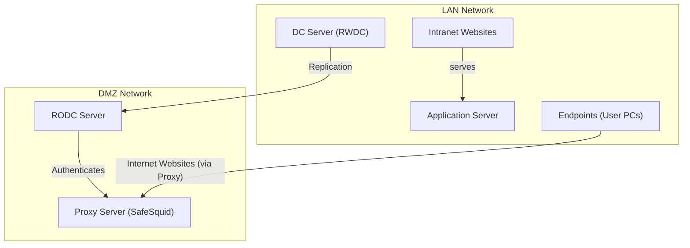

import Tabs from '@theme/Tabs';
import TabItem from '@theme/TabItem';

## Overview

Organizations with remote sites face a dilemma: deploying a full Domain Controller (DC) at each site is a security risk, but without a local DC, login requests must travel over the WAN causing slowness and outages if the connection drops.

When SafeSquid SWG is deployed at remote sites or in a DMZ, it authenticates users against Active Directory to apply role-based web access policies. Without a local DC, SafeSquid falls back to IP-based rules, losing user-level control.

Placing an RODC in the DMZ alongside SafeSquid solves this authentication stays local and fast, while the read-only nature of the RODC limits exposure if the DMZ is compromised.

:::warning
The RODC **cannot** create computer objects or register SPNs by itself. All AD preparation **must be done on the Writable DC (RWDC)**, then pushed to the RODC through replication.
:::

---

## Benefits of Using RODC with SafeSquid SWG

- **Reliable Authentication** - SafeSquid resolves user identities locally without depending on a WAN link to the central DC.
- **Role-Based Web Access** - An RODC provides real-time group membership data so SafeSquid can enforce per-user, per-department policies.
- **Contained DMZ Risk** - Because the RODC is read-only, a DMZ compromise cannot modify AD data or propagate changes to the main domain.
- **Accurate Per-User Logging** - SafeSquid logs web requests against authenticated user identities rather than IP addresses, supporting compliance and audits.
- **Delegated Administration** - RODC's Administrator Role Separation lets local staff manage the RODC without domain admin rights mirroring SafeSquid's own role-based policy model.
- **Consistent Security Across All Sites** - The same web policies and access controls apply at every location, with no gaps due to WAN unavailability.

---

## Why This Architecture Uses an RODC in the DMZ

This is based on the **LAN + DMZ split** pattern, where the proxy is intentionally placed outside the trusted internal network.



| Component | Location | Role |
| :--- | :--- | :--- |
| **DC Server (RWDC)** | LAN | Authoritative, writable Active Directory server. All identity creation happens here. |
| **Endpoints (User PCs)** | LAN | Corporate workstations joined to the AD domain. Users log in with domain credentials. |
| **RODC Server** | DMZ | Read-only AD replica. Can authenticate users locally but **cannot write to AD**. |
| **Proxy Server (SafeSquid)** | DMZ | Intercepts all outbound internet traffic and enforces authentication, policies, and filtering. |

A full Writable DC in the DMZ would expose the entire AD identity store to the internet-facing network. The RODC is the correct choice because it can verify Kerberos tickets (for cached accounts), cannot accept write operations, and holds only a controlled subset of AD data.

---

## How to Integrate SafeSquid with RODC

| Phase | What You Do | Where |
| :--- | :--- | :--- |
| **Phase 1** | Create the SafeSquid computer object + SPNs in Active Directory | On the **Writable DC (RWDC)** |
| **Phase 2** | Allow the RODC to cache the SafeSquid account via Password Replication Policy | On the **RWDC** (AD Users & Computers) |
| **Phase 3** | Point SafeSquid's LDAP configuration to the RODC using `NEGOTIATE_LDAP_AUTH` | In the **SafeSquid web interface** |

## How Kerberos SSO Works in This Setup


| Stage | Who Does It | Why |
| :--- | :--- | :--- |
| Create SafeSquid object + SPNs | **Writable DC (RWDC)** | Only the RWDC can write to Active Directory |
| Cache the identity | **RODC** | Receives replicated data from RWDC |
| Issue Kerberos ticket | **RODC** | Serves users locally in the DMZ, fast and secure |
| Validate ticket at proxy | **SafeSquid → RODC** | LDAP bind confirms the user's ticket is genuine |

---

## Prerequisites

- **Administrator access** to a Writable Domain Controller (RWDC).
- **Hostname and IP** of your RODC (in the DMZ).
- **Hostname** of your SafeSquid proxy VM/ISO.
- **Active Directory PowerShell module** installed on the RWDC.
- SafeSquid and the RODC are **network-reachable** from each other (firewall allows LDAP port 389/636).

Run this on the RWDC to confirm you're targeting the PDC Emulator:

```powershell
$TargetDC = (Get-ADDomainController -Discover -Service PrimaryDC).HostName | Select-Object -First 1
Write-Host "Operations will be performed on: $TargetDC" -ForegroundColor Cyan
```

---

## Placeholder Reference Table

| Placeholder | Description | Example Value | Command to Find It |
| :--- | :--- | :--- | :--- |
| `<ProxyHostname>` | Hostname of your SafeSquid proxy VM/machine. | `proxy-01` | Run `hostname` on the SafeSquid machine |
| `<your.domain.name>` | Your Active Directory domain name (FQDN). | `company.local` | `(Get-ADDomain).DNSRoot` |
| `<REALM>` | Your AD domain name in ALL CAPS. | `COMPANY.LOCAL` | `(Get-ADDomain).DNSRoot.ToUpper()` |
| `$ComputerName` | The name of the AD computer object. **Do not change this.** | `safesquid` | Fixed value - do not look up |
| `<RODC_Hostname>` | Hostname of your Read-Only Domain Controller. | `rodc-01` | `Get-ADDomainController -Filter {IsReadOnly -eq $true} \| Select-Object HostName` |
| `<RODC_IP>` | IP address of your Read-Only Domain Controller. | `192.168.1.10` | `Get-ADDomainController -Filter {IsReadOnly -eq $true} \| Select-Object IPv4Address` |

---

## AD Object Configuration Reference

### Computer Object Attributes

| Attribute | Required Value | Notes |
|---|---|---|
| **Name** | `safesquid` | Fixed - do not change |
| **SamAccountName** | `safesquid$` | `$` suffix is the AD computer account convention |
| **UPN** | `safesquid.<REALM>@<REALM>` | e.g., `safesquid.COMPANY.LOCAL@COMPANY.LOCAL` |
| **UAC Bitmask** | `33624064` | `WORKSTATION_TRUST` + `DONT_EXPIRE_PASSWORD` + `PARTIAL_SECRETS` (RODC-compatible) |
| **Encryption Type** | `28` | RC4 (4) + AES-128 (8) + AES-256 (16) |

### Required Service Principal Names (SPNs)

| SPN Type | Format | Example Value | Purpose |
| :--- | :--- | :--- | :--- |
| **Proxy Host (FQDN)** | `HOST/<ProxyHostname>.<REALM>` | `HOST/proxy-01.COMPANY.LOCAL` | Required by `msktutil` for keytab generation |
| **Proxy HTTP (FQDN)** | `HTTP/<ProxyHostname>.<REALM>` | `HTTP/proxy-01.COMPANY.LOCAL` | Browser ticket requests using actual VM hostname |
| **Proxy LDAP (FQDN)** | `LDAP/<ProxyHostname>.<REALM>` | `LDAP/proxy-01.COMPANY.LOCAL` | LDAP bind using actual VM hostname |
| **Common Host (FQDN)** | `HOST/safesquid.<REALM>` | `HOST/safesquid.COMPANY.LOCAL` | Kerberos identity for the common `safesquid` name |
| **Common HTTP (FQDN)** | `HTTP/safesquid.<REALM>` | `HTTP/safesquid.COMPANY.LOCAL` | **Primary SPN** - used when browser connects via PAC file |
| **Common LDAP (FQDN)** | `LDAP/safesquid.<REALM>` | `LDAP/safesquid.COMPANY.LOCAL` | LDAP searching via the common `safesquid` identity |
| **Common Host (Short)** | `host/safesquid` | `host/safesquid` | Short/NetBIOS form - legacy Windows client compatibility |

## Verify Registered SPNs

```powershell
Get-ADComputer safesquid -Properties servicePrincipalName | Select-Object -ExpandProperty servicePrincipalName
```

---

## Phase 1: Active Directory Preparation (on the RWDC)

<Tabs>
<TabItem value="manual" label="Manual Steps">

### Step 1: Initialize Identity

```powershell
$TargetDC      = (Get-ADDomainController -Discover -Service PrimaryDC).HostName | Select-Object -First 1
$ProxyHostname = "<ProxyHostname>"
$DomainName    = "<your.domain.name>"
$Realm         = $DomainName.ToUpper()
$ComputerName  = "safesquid"                 # Do NOT change this
```

### Step 2: Create or Update Object

```powershell
New-ADComputer -Name $ComputerName -Server $TargetDC `
    -SamAccountName "$ComputerName$" `
    -Path "CN=Computers,DC=$($DomainName.Replace('.', ',DC='))" `
    -DNSHostName "$ComputerName.$DomainName" `
    -UserPrincipalName "$ComputerName.$Realm@$Realm" `
    -Enabled $true

Set-ADComputer -Identity $ComputerName -Server $TargetDC `
    -DNSHostName "$ComputerName.$DomainName" `
    -UserPrincipalName "$ComputerName.$Realm@$Realm"
```

### Step 3: Register SPNs (Differential Update)

```powershell
$obj = Get-ADComputer -Identity $ComputerName -Server $TargetDC -Properties servicePrincipalName

$Desired = @(
    "HOST/$ProxyHostname.$Realm", "HTTP/$ProxyHostname.$Realm", "LDAP/$ProxyHostname.$Realm",
    "HOST/$ComputerName.$Realm", "HTTP/$ComputerName.$Realm", "LDAP/$ComputerName.$Realm",
    "host/$ComputerName"
)

$toAdd = $Desired | Where-Object { $_ -notin $obj.servicePrincipalName }

if ($toAdd) {
    Set-ADComputer -Identity $obj.DistinguishedName -Server $TargetDC -Add @{ servicePrincipalName = $toAdd }
    Write-Host "Added missing SPNs."
}
```

### Step 4: Security Flags (UAC & AES)

```powershell
Set-ADObject -Identity $obj.DistinguishedName -Server $TargetDC `
    -Replace @{
        userAccountControl              = 33624064
        'msDS-SupportedEncryptionTypes' = 28
    }
```

</TabItem>
<TabItem value="script" label="Automated Script">

#### How to Run This Script
1. Save the code below as `Replicate-ADComputer.ps1` on your **Writable DC**.
2. Fill in your values under `SET YOUR VARIABLES HERE`.
3. Open PowerShell as Administrator and run:
    ```powershell
    Set-ExecutionPolicy -ExecutionPolicy Bypass -Scope Process; .\Replicate-ADComputer.ps1
    ```

```powershell
# =========================================================================
# SAFESQUID MASTER AD PREPARATION SCRIPT (GENERAL)
# =========================================================================
Import-Module ActiveDirectory

# --- 1. SET YOUR VARIABLES HERE ---
$ProxyHostname = "<ProxyHostname>"
$DomainName    = "<your.domain.name>"
$ComputerName  = "safesquid"                  # Do NOT change this

# --- 2. AUTOMATED LOGIC ---
$SAMAccount  = "$ComputerName$"
$Realm       = $DomainName.ToUpper()
$BaseDCPath  = ($DomainName -split '\.' | ForEach-Object { "DC=$_" }) -join ','
$UPN         = "$ComputerName.$Realm@$Realm"
$DNSHostName = "$ComputerName.$DomainName"

$TargetDC = (Get-ADDomainController -Discover -Service PrimaryDC).HostName | Select-Object -First 1
Write-Host "Targeting DC: $TargetDC" -ForegroundColor Cyan

$DesiredSPNs = @(
    "HOST/$ProxyHostname.$Realm", "HTTP/$ProxyHostname.$Realm", "LDAP/$ProxyHostname.$Realm",
    "HOST/$ComputerName.$Realm", "HTTP/$ComputerName.$Realm", "LDAP/$ComputerName.$Realm",
    "host/$ComputerName"
)

# --- 3. EXECUTION ---
$Existing = Get-ADComputer -Filter "SamAccountName -eq '$SAMAccount'" -Server $TargetDC -Properties servicePrincipalName -ErrorAction SilentlyContinue

if ($Existing) {
    Write-Host "Object found, updating attributes..." -ForegroundColor Yellow
    Set-ADComputer -Identity $Existing.DistinguishedName -Server $TargetDC -DNSHostName $DNSHostName -UserPrincipalName $UPN
    $SPNsToAdd = $DesiredSPNs | Where-Object { $_ -notin $Existing.servicePrincipalName }
    if ($SPNsToAdd) { Set-ADComputer -Identity $Existing.DistinguishedName -Server $TargetDC -Add @{ servicePrincipalName = $SPNsToAdd } }
    Write-Host "SPNs updated." -ForegroundColor Green
} else {
    Write-Host "Creating new computer object..." -ForegroundColor Cyan
    New-ADComputer -Name $ComputerName -Server $TargetDC -Path "CN=Computers,$BaseDCPath" -DNSHostName $DNSHostName -UserPrincipalName $UPN -ServicePrincipalNames $DesiredSPNs -Enabled $true
}

$FinalObj = Get-ADComputer -Identity $ComputerName -Server $TargetDC
Set-ADObject -Identity $FinalObj.DistinguishedName -Server $TargetDC -Replace @{
    userAccountControl              = 33624064
    'msDS-SupportedEncryptionTypes' = 28
}

Write-Host "`nSUCCESS: Active Directory is now configured for SafeSquid." -ForegroundColor Green
```

</TabItem>
</Tabs>

---

## Phase 2: Configure Password Replication Policy (PRP)

The RODC must be explicitly allowed to **cache the SafeSquid computer account password**. Without this, the RODC will refer every ticket request back to the RWDC, introducing latency and potential failures.

1. Open **Active Directory Users and Computers** on the RWDC.
2. Navigate to the **Domain Controllers** OU.
3. Right-click your **RODC** → **Properties** → **Password Replication Policy** tab.
4. Click **Add** → select the **safesquid** computer account → set to **"Allowed"**.

:::note
After adding the policy, wait up to 15 minutes for initial replication, or trigger a manual sync with `repadmin /syncall` on the RWDC.
:::

---

## Phase 3: SafeSquid Interface Setup

Navigate to **Application Setup** → **Integrate LDAP** → **LDAP servers**.


| Parameter | Configuration Value |
| :--- | :--- |
| **Enabled** | `TRUE` |
| **Ldap FQDN\IP** | `<RODC_Hostname>` or `<RODC_IP>` |
| **Ldap Bind Method** | `NEGOTIATE_LDAP_AUTH` |
| **Ldap Username** | `administrator@<your.domain.name>` |
| **Ldap Basedn** | `dc=<domain_part1>,dc=<domain_part2>` |
| **Ldap Domain** | `<your.domain.name>` |

:::warning
The **Ldap Bind Method** must be set to **NEGOTIATE_LDAP_AUTH**. This triggers the Kerberos ticket exchange instead of a basic LDAP bind - it is the core of SSO functionality.
:::

### Verification: Confirm LDAP is Working

Once saved, navigate to the **LDAP Entries** tab. A successful bind will populate the table with user and computer objects from Active Directory:


| Column | What It Shows |
| :--- | :--- |
| **Login Attribute** | User or computer account UPN (e.g., `ADMINISTRATOR@SAFESQUID.INTRANET`) |
| **LDAP Domain** | Distinguished Name path of the object in AD |
| **LDAP Profiles** | AD groups the user belongs to - used for role-based policy matching |

:::note
If **LDAP Entries** is empty after saving, the LDAP bind has failed. Double-check the RODC hostname/IP, `Ldap Username` credentials, and confirm the RODC's Password Replication Policy includes the `safesquid` account.
:::

---

## Troubleshooting

### Keytab Generation Fails
- **Symptom**: SafeSquid logs show `kerberos: main: Generate Keytab: failed`.
- **Cause**: The RODC's Password Replication Policy hasn't cached the SafeSquid account yet.
- **Fix**: Run `repadmin /syncall /AdeP` on the RWDC, or wait 15 minutes.

### 407 Proxy Authentication Required (After Setup)
- **Cause 1 - Time Drift**: Kerberos requires clocks within 5 minutes of each other. Check with `date` on all servers.
- **Cause 2 - SPN Mismatch**: The browser is requesting a ticket for a hostname not registered as an SPN. Verify all 7 SPNs with `Get-ADComputer safesquid -Properties servicePrincipalName`.
- **Cause 3 - PRP Not Set**: The RODC hasn't cached the password. Verify the Password Replication Policy includes `safesquid`.

### RODC Refers Requests to RWDC ("Referral" Error)
- **Cause**: The RODC received an account request it can't serve locally and redirects to the RWDC.
- **Fix**: Ensure PRP is configured as described in Phase 2 and allow sufficient replication time.