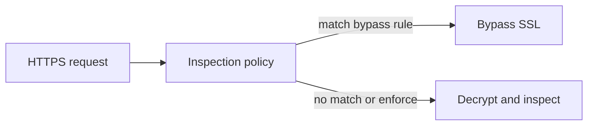

## Encrypted HTTPS hides threats; inspection restores visibility

Encrypted HTTPS traffic conceals malicious payloads, phishing attempts, and data leakage. Enterprises need visibility for web usage policies, malware scanning, and data exfiltration prevention. Privacy-sensitive domains (e.g. banking, healthcare) must remain uninspected for GDPR and HIPAA compliance.

SafeSquid inspects HTTPS traffic with minimal administrative overhead and no end-user disruption. It supports Zero-Trust architecture, policy-based bypass, and real-time threat prevention:

- Visibility into encrypted sessions
- User experience without certificate errors
- Granular bypass policies for compliance
- Contextual intelligence for security decisions

## How SafeSquid SSL Inspection Works

1. SafeSquid intercepts HTTPS CONNECT requests and establishes dual SSL tunnels:

   - Client ⇌ SafeSquid (using SafeSquid-generated certificate)
   - SafeSquid ⇌ Destination Server (using server's actual certificate)

2. Decrypts data streams to enforce security policies:

   - Malware scanning
   - Data Loss Prevention (DLP)
   - URL filtering and access control

3. Re-encrypts and forwards traffic back to clients.

4. Key features include:

   - On-the-fly TLS/SSL decryption
   - Real-time SSL certificate validation and chain repair
   - SNI-aware transparent proxying

Decision flow for each HTTPS connection:

## Documents in this section

### [Configure HTTPS Inspection](01-Configure%20HTTPS%20Inspection.md)
HTTPS traffic must be decrypted for policy enforcement and threat prevention. This document covers prerequisites, generating or importing certificates via the Self-Service Portal, enabling inspection in the Configuration Portal, importing the Root CA into Firefox, testing inspection, configuring bypass rules, and solution verification. Follow it to deploy and validate HTTPS inspection end-to-end.
