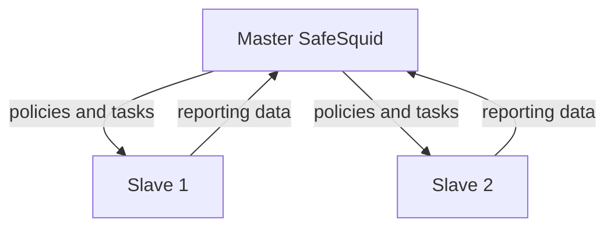

## What does Master/Slave mean?
In computer networking, master/slave is a model for a communication in which one device or process (known as the master) controls one or more other devices or processes (known as slaves). Once the master/slave relationship is established, the direction of control is always from the master to the slave(s).

In a master-slave configuration of SafeSquid, a specific instance of SafeSquid (the master server) manages other instances of SafeSquid (the slave servers). The stand-alone and slave instances are almost identical in functionality.

Control and policy flow from master to slaves; reporting data flows from slaves to master:

A slave server acts as a single (stand-alone) instance of SafeSquid, managing network computers. Furthermore, the slave server receives policies and tasks from its master server.

The master server does not have its own managed computers, but it indirectly manages those of its slave servers by assigning policies and tasks to them. Another purpose of the master server is to provide you with information on the network security status, by centralizing data from all managed servers. In this way, you can get centralized results from all the clients of the slave servers in a single report.

## Prerequisites
SafeSquid should be installed and activated using same product activation key on all the machines (master as well as slave)

## Master Slave configuration

## [Access the SafeSquid User Interface](/docs/SafeSquid_SWG/Configuration_Portal/)

## Configuration on Slave Server

## Go to Support

## Go to Startup params

## Configuration on Master Server if authentication is Enabled

## Go to Access Restriction under Application Setup

## Go to Allow list

## Verify the synchronization of defined sections on Slave server

## Verification and Evidence

- **Interface Checks**: On the slave, open [Configuration Portal](/docs/SafeSquid_SWG/Configuration_Portal/) and confirm Support → Startup params show the master IP and port. On the master, confirm Access Restriction → Allow list includes the slave and policies are enabled.
- **Log Analysis**: Check slave logs for successful sync events; config and policy updates from master should appear after changes on the master.
- **Performance Validation**: Make a configuration change on the master and confirm it propagates to the slave; verify centralized [Reporting](/docs/Audit_Forensics/Reporting_Module/) shows data from all slaves.

**Related**: [Configuration Sync](/docs/Proxy_Clustering/Configuration_Sync/), [Configuration Portal](/docs/SafeSquid_SWG/Configuration_Portal/), [Reporting Module](/docs/Audit_Forensics/Reporting_Module/), [Troubleshooting](/docs/Troubleshooting/main/)

