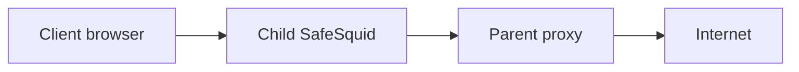

<section class="section-strip">

# Forward client traffic through a parent proxy

Use SafeSquid as a child proxy in front of a corporate (parent) proxy. A simple configuration in SafeSquid forwards all client requests to the parent proxy. SafeSquid can still perform HTTPS inspection and policy enforcement before forwarding; the parent handles upstream connectivity and any corporate policy.

Traffic flows from the client through the child SafeSquid to the parent proxy, then to the internet:

Example scenarios:

Here am using two proxy servers as SafeSquid only

My client (Browser)## 's network IP - 192.168.0.27

My Child Proxy## 's network IP - 192.168.27.50 (with no direct internet Access)

My Parent Proxy## 's network IP - 192.168.27.100

**Configuration on child proxy:**

1. Deploy SafeSquid proxy
2. Enabling SSL inspection in SafeSquid
3. Downloading ROOT CA certificate from SafeSquid
4. Deploy certificate in client browsers.
5. Enable forwarding to parent proxy using forwarding section

**Configuration on Parent proxy:**

Deploy SafeSquid, it is up and running, no extra configuration required in parent proxy

</section>

<section class="section-strip">

## Prerequisites
Enable HTTPS inspection on child proxy (optionally on parent proxy also). Check our document to configure HTTPS inspection on SafeSquid - [How to configure HTTPS inspection](/docs/SSL_Inspection/main/)

Import SafeSquid child proxy ROOT CA in client browser

Note: No configuration required on Parent Proxy server. Just deploy the parent proxy and make sure that it is up and running.

</section>

<section class="section-strip">

## Configure proxy chain in SafeSquid

Access the [SafeSquid Configuration Portal](/docs/SafeSquid_SWG/Configuration_Portal/).

### Open Configure page

### Open Application Setup → Proxy chain

### Enable Global section

### Open Forwarding proxies and add an entry

In the example: my upstream proxy ip: 192.168.27.100

In example: my upstream proxy listening on port 8080

### Test proxy chain connectivity

### Save configuration

When the administrator clicks Save config, a prompt asks for confirmation to store the configuration in the cloud.

Select Yes only in below cases:

to reuse this configuration in other SafeSquid instances.

if the total configuration in all sections is completed and validated.

Otherwise select No and click on submit.

</section>

<section class="section-strip">

## Verification and Evidence

- **Interface Checks**: In [Configuration Portal](/docs/SafeSquid_SWG/Configuration_Portal/), open Application Setup → Proxy chain. Confirm Global is enabled and the forwarding proxy entry shows the correct parent IP and port.
- **Log Analysis**: Check SafeSquid access logs for requests showing the parent proxy as upstream; connection failures to the parent appear in logs with connect errors.
- **Performance Validation**: From a client behind the child proxy, browse an external site; traffic should succeed and appear in both child and parent proxy logs.

</section>

<section class="section-strip">

## Next steps

- [Forward Proxy](/docs/Operational_Modes/Forward_Proxy/) for explicit proxy without chaining.
- [SSL Inspection](/docs/SSL_Inspection/Configure_HTTPS_Inspection/) for HTTPS inspection on the child proxy.
- [Troubleshooting](/docs/Troubleshooting/main/) if connectivity or parent proxy errors occur.

</section>