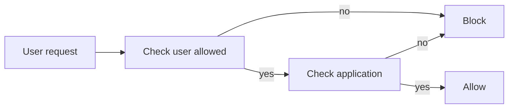

## Allow remote applications for specific users

When all traffic is blocked for security, some users may need access to remote applications. SafeSquid allows the administrator to permit specific users or groups to access remote applications.

## How it works?
When a user tries to access a remote application, First SafeSquid checks for that user and decides whether this user is allowed to access a remote application or not, if yes then SafeSquid gives access to that user, and before giving the access it will check for user-agent. If access is allowed to both users and the application, then only the user can able to access that application. If the user **Samidha wants access** to the XYZ application but is trying to access the **ABC** application, SafeSquid will block to user Samidha.

:::note
Remote applications like Anydesk® and Ammyadmin™ do not support SSO authentication. If SSO authentication is enabled, bypass it for these applications.
:::

Remote applications like **Remote desktop applications, Download managers**, etc. (Anydesk and Teamviewer®) should get automatically blocked if HTTPS inspection is enabled. No need to configure any policy for blocking purposes.

## [Access the SafeSquid interface](/docs/SafeSquid_SWG/Configuration_Portal/)

## Go to configure page

## Go to Real-time content security: HTTPS Inspection

## Go to Restriction Policies

## Configuration on Anydesk®
### Set proxy on Anydesk application
If authentication is enabled, specify the username and password in the AnyDesk application. AnyDesk does not use system proxy settings automatically. Configure the proxy in the AnyDesk application. AnyDesk and Ammyadmin do not support SSO; bypass SSO for them if enabled.

### Create policy without application signature
Remote applications may already exist in SafeSquid Application Signatures. Check whether the application is categorized first.

If an application is not categorized under default Application Signatures, find the User-agent using SafeSquid's extended logs or any other traffic-capturing tool.

### Add that User-agent or website into request types
Bind that created user group and Request Type in Access Profiles and decide whether to block or allow.

## Verification and Evidence

- **Interface Checks**: In [Configuration Portal](/docs/SafeSquid_SWG/Configuration_Portal/), confirm Real-time content security → HTTPS Inspection has Bypass SSL Inspection policy enabled, and Restriction Policies → Access profiles show the allow policy for the remote desktop application with the correct request type and Bypass SSL Inspection profile.
- **Log Analysis**: SafeSquid access logs should show successful CONNECT or requests for the remote app when allowed; blocked attempts appear with deny or policy response codes.
- **Performance Validation**: From an allowed user and device, launch [AnyDesk](https://anydesk.com/) (or the configured app) with proxy set; connection should succeed. From a non-allowed user or app, access should be blocked.

**Related**: [SSL Inspection](/docs/SSL_Inspection/main/), [Access Restriction](/docs/Access_Restriction/main/), [Application Signatures](/docs/Profiling_Engine/Application_Signatures/), [Restrict AnyDesk](/docs/Use_Cases/Restrict_anydesk/), [Troubleshooting](/docs/Troubleshooting/main/)

