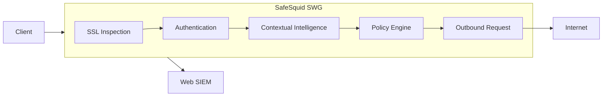

# [Zero-Trust Web Security](/overview/zero_trust_web_security/zero_trust_web_security)

Since the birth of the web, enterprises have faced a constant trade-off between productivity and risk. Web Services improve business efficiency, but also opened new paths for data leakage, phishing, malware delivery, ransomware, botnets, privacy abuse, and zero-day exploitation. 

Legacy defences such as endpoint security, URL filtering, and firewalls improve baseline protection, but struggle against modern web traffic shaped by encrypted sessions, user-generated content, SaaS platforms, and interconnected Layer-7 services. Endpoint controls are hard to scale and manage uniformly. Network firewalls secure Layers 3 and 4, but effective web security requires Layer-7 inspection before threats reach endpoints. Traditionally, Application Layer Firewalls seek to re-purpose web caching proxy technologies. Inherent limitations thus not only restrict security capabilities but also impact performance when multiple security options are enabled.

Zero-Trust Web Security requires continuous, multi-dimensional Layer-7 inspection of every DNS and HTTP(S) transaction, with policy decisions driven by protocol metadata, payload, identity, context, destination, and session correlation.

# [What is SafeSquid SWG](/overview/safesquid_swg/what_is_safesquid_swg)

To address these shortcomings, SafeSquid was introduced in 2004 as a purpose-built HTTP Proxy Server, designed specifically for Zero-Trust Web security. Multiple specialised security processors execute in a shared‑memory, in‑stream pipeline on the same transaction context for Layer 7 inspection, and policy enforcement. The purpose-oriented architecture promises scalable performance while ensuring comprehensive mitigation of Layer 7 threats.

Pioneering solutions to mitigate web-based threats, yet unaddressed by alternatives, highlights SafeSquid’s evolution since its maiden release in 2004. Collaboration with security specialists, administrators, and vendors world-wide sets the innovation goals.

## How SafeSquid Enforces Policy

SafeSquid terminates the client-side TLS session, inspects and enforces policy on the plaintext request, and establishes a new TLS session to the origin. Every step is logged.

Each transaction log entry captures: user identity, source IP, destination URL, TLS certificate chain, content category, policy rule matched, DLP outcome, and disposition (allowed / blocked / inspected). Log entries are SIEM-ready and satisfy per-transaction evidence requirements under RBI Master Direction 2023, SEBI CSCRF, NIST SP 800-92, PCI-DSS Requirement 10, SOC 2 CC7.2, and ISO 27001 A.12.4.

## What SafeSquid Adds to a Standard Proxy

| Capability | Custom Squid Build | SafeSquid SWG |
|---|---|---|
| HTTPS / TLS 1.3 deep inspection | ❌ ssl-bump incompatible with TLS 1.3 in legacy builds; requires manual cert infrastructure | ✅ Full TLS 1.0–1.3 inspection; managed certificate lifecycle |
| Identity-aware policy (AD / LDAP / RADIUS) | ❌ No native integration; requires custom scripting | ✅ Per-user and per-group rules; native directory integration |
| Application signatures | ❌ Not available | ✅ 1,000+ apps — TeamViewer, Tor, Zoom, WhatsApp Web; SNI, header, and behavioural detection |
| Data Loss Prevention | ❌ Not available | ✅ Keyword, file type, size threshold, regex; outbound content inspection |
| Compliance-grade per-user audit logs | ⚠️ Basic access log only; no user identity; not SIEM-ready | ✅ Per-transaction: user identity, policy rule, category, disposition, TLS chain; SIEM-ready |
| Zero-trust deny-by-default engine | ❌ Not built-in | ✅ Explicit allow required; unrecognised traffic blocked by default |
| Supported commercial product | ❌ Internal maintenance burden; no vendor support | ✅ Active release cycle; commercial support; AMC available |

## When to Deploy SafeSquid

**✅ Deploy SafeSquid when:**

- HTTPS/TLS inspection is required to enforce URL policy, detect malware, or prevent data exfiltration
- Policy must be enforced per user or per group — not per IP address
- Audit-ready per-user logs are required for RBI Master Direction 2023, SEBI CSCRF, IRDAI Cybersecurity Guidelines 2023, NCIIPC CII Guidelines, or CERT-In Directions (April 2022)
- Cloud-hosted SWG is excluded on data sovereignty grounds, US sanctions restrictions, or RBI data localisation requirements
- A custom-built or open-source proxy deployment is reaching end of maintainability — TLS 1.3 incompatibility, scaling constraints, or internal skill loss

**❌ Do not deploy SafeSquid when:**

- HTTP caching and bandwidth savings are the only requirement, with no inspection or identity-aware policy need — a standard Squid deployment is proportionate
- No user identity source (Active Directory, LDAP, RADIUS) is available — identity-aware policy cannot be enforced without a directory
- Fewer than 200–300 internet-connected users and no compliance driver — a UTM appliance with integrated URL filtering may be proportionate

## Deploy in Five Steps

Built on an open architecture and delivered as a 100% software solution, SafeSquid deploys on any standard hardware, virtual machine, or cloud instance without requiring proprietary appliances.

1. [Register and obtain an activation key](/Register) — create an account on the SafeSquid Self-Service Portal in under five minutes.
2. Deploy the gateway — [SafeSquid Appliance Builder ISO](/getting-started/quickstart/SafeSquid_Appliance_Builder) installs on any standard Intel server in under 15 minutes; [Cloud Deployment](/getting-started/quickstart/Cloud_Deployment) covers AWS, Azure, and GCP.
3. [Route client traffic through the proxy](/getting-started/client-configuration/Connect_Your_Client) — explicit proxy, PAC file, transparent proxy, or enterprise GPO.
4. [Activate the license and configure policies](/getting-started/introduction/Configure_Web_Security_Policies) — enable SSL inspection, user identity integration, URL categories, and DLP rules.
5. Verify enforcement — browse a blocked category from a test client; confirm the block page renders and the transaction appears in the access log with user identity, matched policy rule, and disposition.

## Next Steps

- [Zero-Trust Web Security](/getting-started/introduction/Zero-Trust_Web_Security) — threat model, kill chain, and enforcement architecture.
- [What is SafeSquid SWG](/getting-started/introduction/What_is_SafeSquid_SWG) — platform components, inspection pipeline, and deployment scope.
- [Register and Get Your Key](/Register) — begin the activation sequence.
